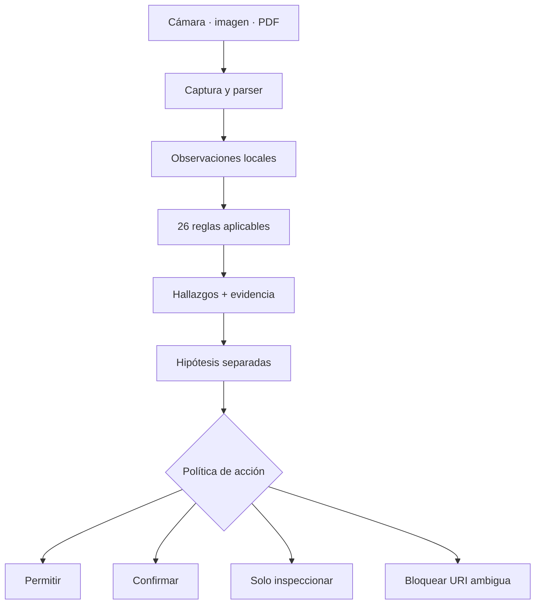

# RootCause QR Inspector

```text
╔═══════════════════════════════════════════════════════════════════════════════════╗
║                                                                                   ║
║  ██████╗  ██████╗  ██████╗ ████████╗ ██████╗  █████╗ ██╗   ██╗███████╗███████╗    ║
║  ██╔══██╗██╔═══██╗██╔═══██╗╚══██╔══╝██╔════╝ ██╔══██╗██║   ██║██╔════╝██╔════╝    ║
║  ██████╔╝██║   ██║██║   ██║   ██║   ██║      ███████║██║   ██║███████╗█████╗      ║
║  ██╔══██╗██║   ██║██║   ██║   ██║   ██║      ██╔══██║██║   ██║╚════██║██╔══╝      ║
║  ██║  ██║╚██████╔╝╚██████╔╝   ██║   ╚██████╗ ██║  ██║╚██████╔╝███████║███████╗    ║
║  ╚═╝  ╚═╝ ╚═════╝  ╚═════╝    ╚═╝    ╚═════╝ ╚═╝  ╚═╝ ╚═════╝╚══════╝╚══════╝     ║
║                                                                                   ║
║                         Q R   I N S P E C T O R                                   ║
║            Sensor de seguridad QR · Flutter · local-first · v0.1.0                ║
╚═══════════════════════════════════════════════════════════════════════════════════╝
```

<p align="center">
  
</p>

[](CHANGELOG.md)
[](pubspec.yaml)
[](LICENSE)
[](docs/PRIVACY_POLICY.md)
[](https://github.com/vladimiracunadev-create/rootcause-qr-inspector/actions/workflows/flutter-ci.yml)
[](https://vladimiracunadev-create.github.io/rootcause-qr-inspector/)

🔍 **[Inspeccionar un QR ahora →](https://vladimiracunadev-create.github.io/rootcause-qr-inspector/app/)** ·
📱 **[Descargar Android →](https://github.com/vladimiracunadev-create/rootcause-qr-inspector/releases/latest/download/rootcause-qr-inspector-v0.1.0-android.apk)** ·
🌐 **[Página del producto →](https://vladimiracunadev-create.github.io/rootcause-qr-inspector/)** ·
📘 **[Manual de usuario →](docs/MANUAL_USUARIO.md)**

---

**RootCause QR Inspector es el sensor de la familia RootCause para la superficie
QR:** una aplicación de seguridad que convierte una instrucción visual opaca en
hechos observables, hipótesis separadas, una decisión controlada y evidencia
exportable. Todo se analiza en el dispositivo: **telemetría cero**.

> **Diagnóstico primero. Intervención después.**

No es un lector que abre enlaces con una advertencia añadida. Es un **sensor de
apoyo a la decisión**: nunca ejecuta la carga al detectarla, explica por qué un
QR puede ser peligroso y deja que la persona decida después de ver la evidencia.

> **Estado de 0.1.0:** contrato y estructura validados; CI pública en verde con
> análisis, 77 casos Dart/Flutter y builds para Android, web, iOS simulador y
> macOS. Android dispone además de APK instalable de evaluación, checksum y
> procedencia pública; la firma estable, la matriz física amplia y la
> publicación en tiendas siguen pendientes.

## 🔍 Qué problema resuelve

Un QR es una instrucción opaca: a simple vista no permite distinguir el sitio
real de una copia ni un pago legítimo de una sustitución. RootCause QR
Inspector captura la carga, la interpreta, registra hechos observables y aplica
un motor local de 26 reglas con ids estables. Solo después ofrece una acción.

El producto **no se llama “RootCause QR Phishing”** porque RootCause se organiza
por superficie observable. El QR es la superficie; `qr-phishing-suspected` es
una hipótesis derivada cuando la evidencia lo permite.

No es antivirus, reputación web ni garantía de seguridad. No acusa a un dominio
ni declara “enlace seguro”. Expone qué observó, qué no pudo comprobar y qué debe
validar la persona.

| Pregunta de seguridad | Cómo RootCause ayuda |
|---|---|
| ¿Adónde intenta llevarme este QR? | Muestra esquema, host, ruta y campos interpretados **sin abrirlos** |
| ¿El dominio está ofuscado o imita una marca? | Detecta Punycode, Unicode mixto, `userinfo`, subdominios profundos y desajustes de política |
| ¿Puede buscar mis credenciales? | Señala rutas de acceso, verificación, contraseña, banco o MFA y deriva la hipótesis por separado |
| ¿Descarga una app, script o archivo ejecutable? | Clasifica extensiones peligrosas y recomienda inspección independiente |
| ¿Cambia el destinatario de un pago? | Mantiene pagos en confirmación y exige validar beneficiario e importe fuera del QR |
| ¿Puedo compartir lo observado sin filtrar el secreto? | Exporta evidencia redactada con SHA-256, ids estables y límites explícitos |

> 🛡️ **¿Tienes un QR dudoso?** [Inspecciónalo en la PWA](https://vladimiracunadev-create.github.io/rootcause-qr-inspector/app/)
> o carga una imagen/PDF en la app nativa. El análisis no demuestra que un
> destino sea seguro: reduce la opacidad y muestra el peligro observable antes
> de actuar. Cobertura exacta → [`docs/DETECCION_AMENAZAS.md`](docs/DETECCION_AMENAZAS.md)

## 🛡️ Principios no negociables

- **Interpretar antes de actuar:** ninguna carga se abre automáticamente.
- **Hechos antes que hipótesis:** una propiedad observable no se presenta como
  intención, atribución ni veredicto.
- **Privacidad por defecto:** análisis local, persistencia selectiva, evidencia
  redactada y telemetría cero.
- **Acción humana explícita:** incluso una URI interpretable puede requerir
  confirmación; pagos y credenciales necesitan validación independiente.
- **Claims comprobables:** reglas, evidencia, cifrado, builds y límites apuntan a
  código, tests o documentación; lo pendiente se declara como pendiente.

## 🧬 De dónde nace

Este repositorio toma el subsistema operativo de
[Universal Code Scanner v1.1.0](https://github.com/vladimiracunadev-create/universal-code-scanner):

- captura QR, 2D y códigos lineales mediante `mobile_scanner`;
- parser extensible para URL, Wi-Fi, vCard, eventos, OTP, GS1, ISBN, EMVCo,
  EPC/SEPA, Swiss QR, Bitcoin, Lightning, Ethereum y AAMVA;
- cámara, imágenes y PDF por lotes;
- historial e inventario cifrados con AES-256-GCM;
- llave en Keychain/Keystore, bloqueo biométrico y modo temporal;
- importación, recuperación, generador y exportaciones;
- Flutter para Android, iOS, macOS y PWA.

RootCause agrega un contrato de investigación, evidencia con SHA-256, reglas
identificables, puntaje explicable, política de marcas y separación explícita
entre hallazgos e hipótesis. La procedencia exacta está en
[`docs/rootcause/PROVENANCE.md`](docs/rootcause/PROVENANCE.md); la selección de
capacidades y sus cambios está en
[`docs/rootcause/ADOPTION_MATRIX.md`](docs/rootcause/ADOPTION_MATRIX.md).

## 🧠 Del QR a una decisión



## 🧭 Flujo del producto

La interfaz presenta primero la inspección de seguridad y mantiene una jerarquía
única: **observar → explicar el riesgo → decidir → exportar evidencia**. El
inventario y el generador siguen disponibles, pero no compiten con el flujo
principal.

También incluye generación de códigos, importación desde imagen/PDF,
recuperación de registros aislados y ajustes de privacidad y accesibilidad.

La acción se bloquea únicamente cuando la carga no puede entregarse de forma
segura a otra aplicación: esquema no permitido, host inválido, caracteres de
control o autoridad ambigua. Una URL crítica pero interpretable queda en
**confirmación obligatoria**, acompañada de su evidencia.

## 🛡️ Las señales que observa en 0.1.0

| Familia | Hallazgos principales |
|---|---|
| Transporte | HTTP sin TLS, puerto inusual |
| Identidad del host | Punycode, alfabetos mezclados, Unicode, IP literal, dominio profundo, punto final, densidad de guiones |
| Destino | host vacío, red privada/local, acortador |
| Ofuscación | usuario antes del host, controles invisibles, barras/espacios/@ ambiguos, separadores codificados, longitud excesiva |
| Credenciales | rutas de acceso, verificación, cuenta, banco, contraseña o MFA |
| Redirección | URL anidada que cambia de familia de host |
| Descarga | extensiones ejecutables, scripts, instaladores y archivos comprimidos |
| Política organizacional | token de una marca fuera de sus dominios permitidos |
| Acciones sensibles | OTP, pagos interoperables y criptomonedas |
| Contenido opaco | carga binaria no interpretable |

La especificación exacta de los 26 ids, severidades, pesos, evidencia y falsos
positivos está en [`docs/rootcause/HEURISTICS.md`](docs/rootcause/HEURISTICS.md).

## 🔬 Hallazgo no es hipótesis

Ejemplo:

```text
Hallazgos observados
  host-punycode              critical · 20
  credential-lure-path       warning  · 8

Hipótesis derivadas
  qr-phishing-suspected
  credential-theft-suspected
```

“Punycode” es un hecho sobre la carga. “Posible phishing” es una explicación a
investigar. El motor nunca transforma la hipótesis en certeza.

## 🧾 Evidencia exportable

El botón **Evidencia** crea `rootcause.evidence.qr.v1` con:

- instante, origen y simbología;
- SHA-256 de la carga y tamaño en bytes;
- versión del motor, severidad, puntaje y decisión;
- ids de hallazgo, confianza, categoría y hechos que los sustentan;
- hipótesis derivadas;
- reglas evaluadas y límites no evaluables;
- checksum SHA-256 sobre JSON con claves ordenadas y enlace opcional al hash
  anterior.

La carga cruda, los campos interpretados y `effectiveUri` se omiten por defecto
para que una consulta o credencial no reaparezca por una ruta secundaria.
Incluirlos requiere una decisión explícita porque pueden contener OTP,
contraseñas Wi-Fi, identidad, datos personales o instrucciones de pago.
Contrato: [`schemas/rootcause-qr-evidence.schema.json`](schemas/rootcause-qr-evidence.schema.json).

La interfaz 0.1.0 comparte únicamente la variante redactada. La inclusión de
carga completa existe para integraciones mediante el parámetro explícito
`includeRawPayload`; no hay un botón que la active por accidente.

El checksum detecta cambios solo si se compara con una huella obtenida por una
ruta confiable. No es firma digital, MAC ni prueba de quién creó el paquete; el
campo `assurance` lo declara como `checksum-only-not-authenticated`.

## 🏷️ Política de marcas y dominios

El motor no incorpora bancos o empresas como una lista global que envejece. Una
integración puede inyectar sus propios tokens y dominios autorizados mediante
`QrAnalysisPolicy`:

```json
{
  "trustedBrands": [
    {
      "id": "banco-ejemplo",
      "tokens": ["banco-ejemplo"],
      "allowedHosts": ["banco-ejemplo.example"]
    }
  ]
}
```

El ejemplo completo usa únicamente dominios reservados `.example`:
[`config/rootcause-qr-policy.example.json`](config/rootcause-qr-policy.example.json).
La carga de ese archivo desde la interfaz todavía no está implementada en
0.1.0; es un contrato para integradores, no una preferencia activa por defecto.

## 📐 Arquitectura

```text
lib/
├── core/
│   ├── investigation/        contrato, política, motor, textos y export
│   ├── security/             adaptador, cifrado y mantenimiento
│   ├── database/             Sembast / IndexedDB y migraciones
│   └── recovery/             aislamiento y recuperación de registros
├── features/
│   ├── scanner/              cámara y estado observable
│   ├── result/               hallazgos, hipótesis, acciones y evidencia
│   ├── history/              registros cifrados
│   ├── inventory/            sesiones de conteo
│   └── generator/            generación de códigos
├── models/                   entidades inmutables y serializables
├── services/                 parser, importación y exportación
└── state/                    stores ChangeNotifier
```

Detalle: [`docs/rootcause/ARCHITECTURE.md`](docs/rootcause/ARCHITECTURE.md).

## ⚡ Inicio rápido

Requiere Flutter 3.44.7 y Dart 3.12 o superior.

```bash
flutter pub get
python3 tool/bootstrap.py --platforms android,web
python3 tool/validate_structure.py --require-lock
flutter analyze --fatal-infos
flutter test
flutter run
```

Las carpetas nativas se generan de forma reproducible con `tool/bootstrap.py`.
En macOS puede generar también `ios,macos`.

## 🚀 Validación automática

La suite heredada valida cifrado, migraciones, recuperación, parser, cámara,
importación, almacenamiento y accesibilidad. La capa RootCause añade casos para
Punycode, autoridad engañosa, esquemas ejecutables, URL anidada, entrega de APK,
red privada, pagos, política de marca y evidencia alterada.

```bash
python3 tool/verify_rootcause_contract.py
flutter test test/core/qr_investigation_engine_test.dart
flutter test test/core/qr_evidence_exporter_test.dart
```

El estado comprobado y lo pendiente se declara en [`VALIDATION.md`](VALIDATION.md).

La CI conserva como artefactos el APK de depuración, el build web, cobertura,
SBOM CycloneDX, inventario de licencias y checksums. Estos artefactos de CI son
evidencia técnica, no una release firmada para distribución.

## 📱 Plataformas objetivo

| Plataforma | Ruta | Limitación principal |
|---|---|---|
| Android 7+ | app Flutter nativa | APK inicial de evaluación; firma de publicación pendiente |
| iOS 15.5+ | app Flutter nativa | compila para simulador en CI; dispositivo físico y firma pendientes |
| macOS | app Flutter nativa | cámara/galería; dispositivo pendiente |
| Web / PWA | Flutter Web | PDF local no soportado por el renderer actual |
| Windows / Linux | PWA | no hay motor de cámara nativo en 0.1.0 |

## 📦 Estado de entrega del repositorio

### ✅ Incluye

- fuente Flutter, lockfile y generación reproducible de proyectos nativos;
- motor de 26 reglas, contrato JSON, fixtures y pruebas unitarias/widgets;
- historial e inventario cifrados, modo temporal y recuperación;
- CI multi-plataforma, SBOM, licencias, checksums, landing y PWA;
- documentación de arquitectura, operación, amenazas, privacidad y límites.

### ❌ Todavía no incluye

- APK/IPA/app firmados como release para personas usuarias;
- validación completa de cámara, biometría y ciclo de vida en dispositivo físico;
- reputación, DNS, certificados o seguimiento de redirecciones en red;
- editor visual de política organizacional ni correlación automática entre
  productos RootCause.

## 👥 Integración con la familia RootCause

- `rootcause-mobile-inspector` puede correlacionar el instante del escaneo con
  cambios y anomalías del dispositivo.
- `rootcause-web-inspector` puede observar la navegación posterior, permisos,
  sesión y descarga del navegador.
- un futuro `rootcause-schema` puede consumir directamente
  `rootcause.evidence.qr.v1` sin depender del texto español.
- no se envían eventos automáticamente entre productos en 0.1.0; la integración
  actual es por export explícito.

Contrato de integración: [`docs/rootcause/INTEGRATION.md`](docs/rootcause/INTEGRATION.md).

## ⚠️ Limitaciones honestas

El análisis local no puede conocer reputación, edad del dominio, DNS real,
certificado servido, cadena de redirecciones ni si alguien pegó un QR falso
encima del auténtico. Tampoco puede confirmar un beneficiario bancario sin una
fuente independiente.

Una lectura normal significa **“ninguna regla local aplicable disparó”**, no
“sitio seguro”. Ver [`docs/rootcause/LIMITATIONS.md`](docs/rootcause/LIMITATIONS.md).

## 🔒 Privacidad verificable

Sin cuentas, publicidad, analítica ni telemetría. El análisis se ejecuta en el
dispositivo. El historial y los inventarios se cifran antes de escribirse. OTP,
Wi-Fi con contraseña y URLs con claves sensibles quedan fuera del historial
automático. La evidencia solo sale cuando la persona la exporta.

## 📚 Rutas de lectura

| Documento | Contenido |
|---|---|
| [`docs/INDEX.md`](docs/INDEX.md) | Índice por perfil y ruta de lectura recomendada |
| [`docs/MANUAL_USUARIO.md`](docs/MANUAL_USUARIO.md) | Uso de inspección, resultados, historial, inventario y ajustes |
| [`docs/DETECCION_AMENAZAS.md`](docs/DETECCION_AMENAZAS.md) | Cobertura local por amenaza y fronteras de interpretación |
| [`docs/rootcause/ARCHITECTURE.md`](docs/rootcause/ARCHITECTURE.md) | Flujo causal, fronteras, contratos y decisiones |
| [`docs/rootcause/HEURISTICS.md`](docs/rootcause/HEURISTICS.md) | Las 26 reglas, pesos, evidencia y falsos positivos |
| [`docs/rootcause/LIMITATIONS.md`](docs/rootcause/LIMITATIONS.md) | Lo que el análisis local no puede concluir |
| [`schemas/rootcause-qr-evidence.schema.json`](schemas/rootcause-qr-evidence.schema.json) | Contrato JSON de evidencia exportable |
| [`docs/security/THREAT_MODEL.md`](docs/security/THREAT_MODEL.md) | Activos, amenazas, controles y riesgo residual |
| [`docs/CI_GITHUB.md`](docs/CI_GITHUB.md) | Gates, permisos, artefactos y réplica local de CI/Pages |
| [`docs/FAMILIA_ROOTCAUSE.md`](docs/FAMILIA_ROOTCAUSE.md) | Lugar específico del sensor QR dentro de la familia |
| [`docs/ROADMAP.md`](docs/ROADMAP.md) | Estado, candidatos de evolución y no objetivos |
| [`VALIDATION.md`](VALIDATION.md) | Qué se verificó y qué sigue pendiente |
| [`docs/RELEASE.md`](docs/RELEASE.md) | Gate reproducible de publicación |
| [`docs/rootcause/PROVENANCE.md`](docs/rootcause/PROVENANCE.md) | Procedencia y relación con el proyecto base |

## 🤝 Seguridad y colaboración

Los reportes de vulnerabilidad deben seguir [`SECURITY.md`](SECURITY.md) y no
deben incluir QR, OTP, credenciales ni documentos reales. Para proponer cambios,
consulta [`CONTRIBUTING.md`](CONTRIBUTING.md); cada cambio de una regla requiere
actualizar motor, textos, pruebas, documentación y contrato de evidencia.

## 📄 Licencia

MIT · © 2026 Vladimir Acuña. Se conserva la procedencia del código derivado de
Universal Code Scanner en el historial documental y en la licencia.

## ✍️ Autor

[Vladimir Acuña](https://github.com/vladimiracunadev-create) · Full-Stack
Developer & Educator.
