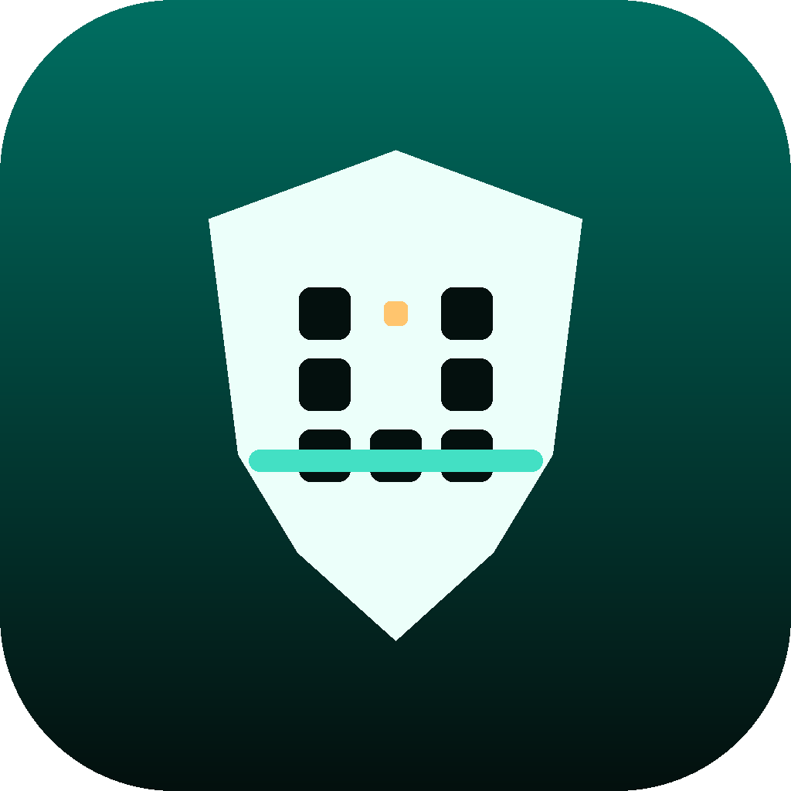
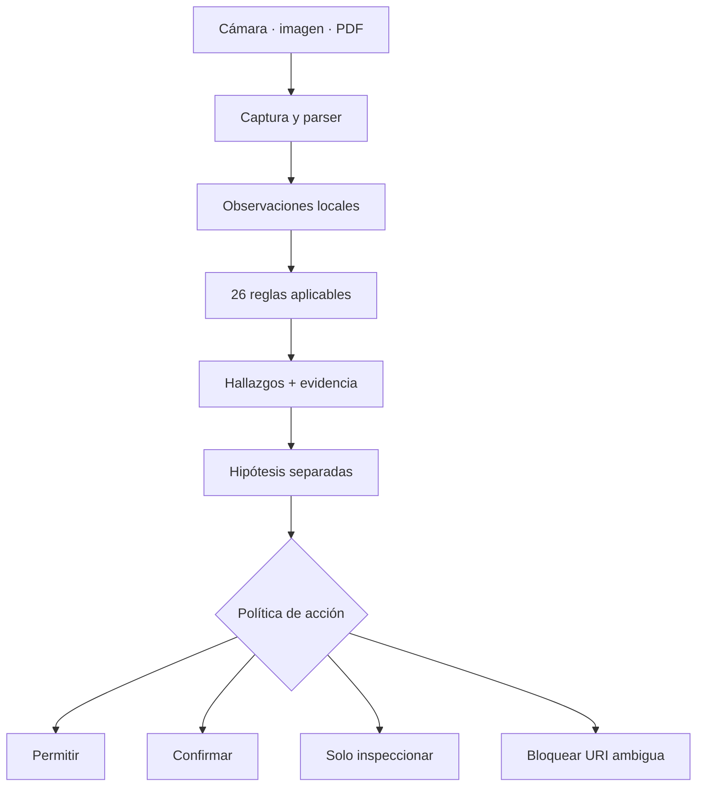
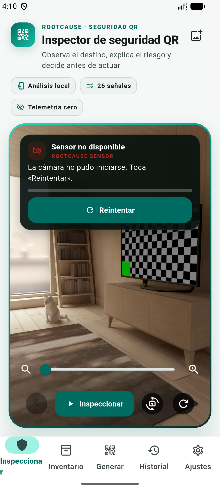
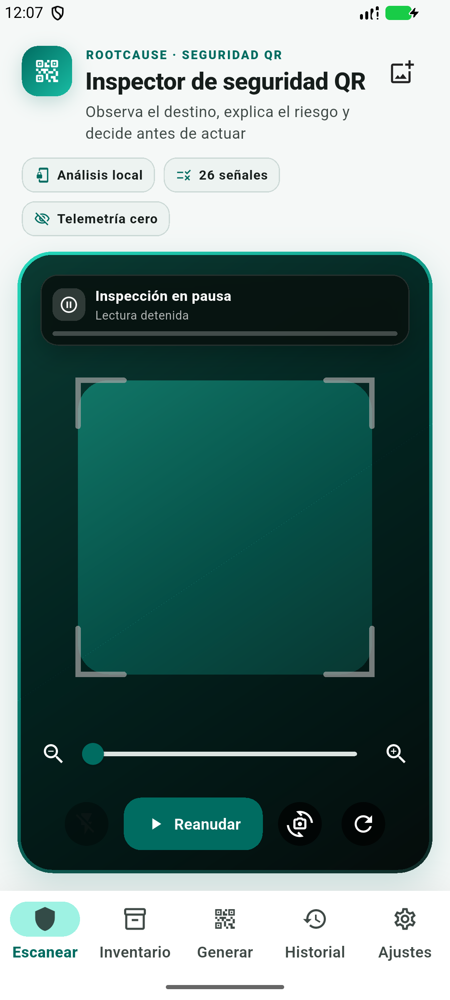
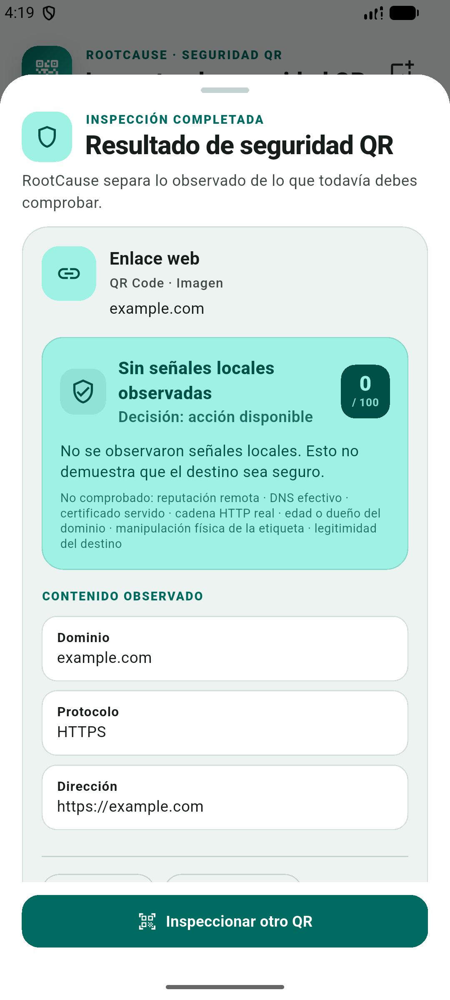
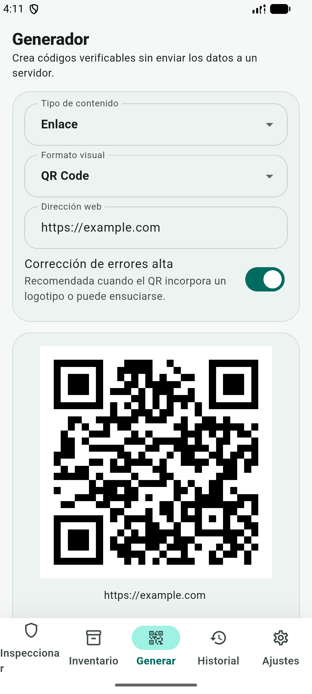
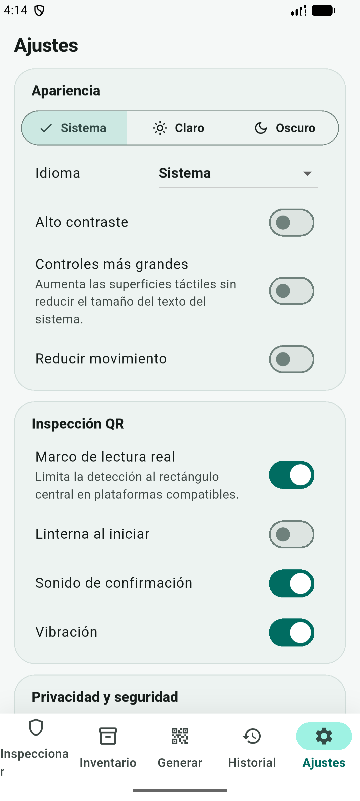
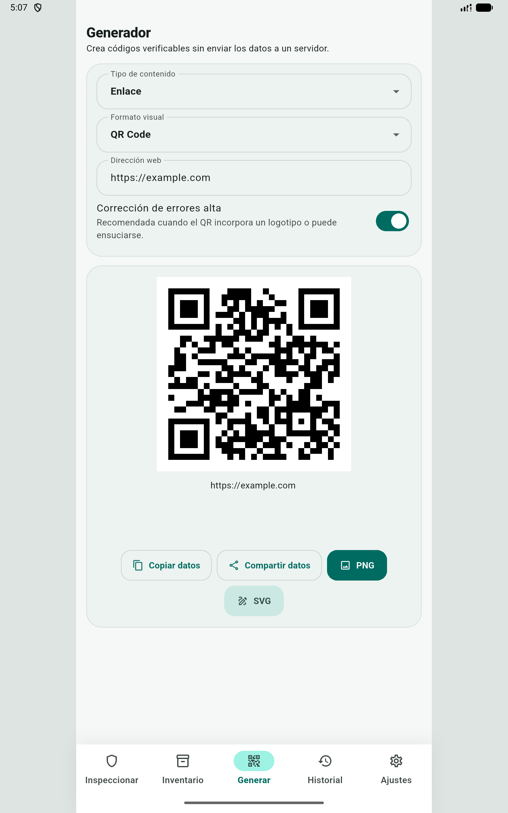

# RootCause QR Inspector

```text
╔═══════════════════════════════════════════════════════════════════════════════════╗
║                                                                                   ║
║  ██████╗  ██████╗  ██████╗ ████████╗ ██████╗  █████╗ ██╗   ██╗███████╗███████╗    ║
║  ██╔══██╗██╔═══██╗██╔═══██╗╚══██╔══╝██╔════╝ ██╔══██╗██║   ██║██╔════╝██╔════╝    ║
║  ██████╔╝██║   ██║██║   ██║   ██║   ██║      ███████║██║   ██║███████╗█████╗      ║
║  ██╔══██╗██║   ██║██║   ██║   ██║   ██║      ██╔══██║██║   ██║╚════██║██╔══╝      ║
║  ██║  ██║╚██████╔╝╚██████╔╝   ██║   ╚██████╗ ██║  ██║╚██████╔╝███████║███████╗    ║
║  ╚═╝  ╚═╝ ╚═════╝  ╚═════╝    ╚═╝    ╚═════╝ ╚═╝  ╚═╝ ╚═════╝╚══════╝╚══════╝     ║
║                                                                                   ║
║                         Q R   I N S P E C T O R                                   ║
║            Sensor de seguridad QR · Flutter · local-first · v0.1.2                ║
╚═══════════════════════════════════════════════════════════════════════════════════╝
```

<p align="center">
  
</p>

[](CHANGELOG.md)
[](pubspec.yaml)
[](LICENSE)
[](docs/PRIVACY_POLICY.md)
[](https://github.com/vladimiracunadev-create/rootcause-qr-inspector/actions/workflows/flutter-ci.yml)
[](https://vladimiracunadev-create.github.io/rootcause-qr-inspector/)

📱 **[Descargar Android →](https://github.com/vladimiracunadev-create/rootcause-qr-inspector/releases/latest/download/rootcause-qr-inspector-v0.1.2-android.apk)** ·
🌐 **[Página del producto →](https://vladimiracunadev-create.github.io/rootcause-qr-inspector/)** ·
📘 **[Manual de usuario →](docs/MANUAL_USUARIO.md)**

---

**RootCause QR Inspector es una app móvil de la familia RootCause para la
superficie QR:** convierte una instrucción visual opaca en hechos observables,
hipótesis separadas, una decisión controlada y evidencia exportable. Todo se
analiza en el dispositivo: **telemetría cero**.

> **Diagnóstico primero. Intervención después.**

No es un lector que abre enlaces con una advertencia añadida. Es un **sensor de
apoyo a la decisión**: nunca ejecuta la carga al detectarla, explica por qué un
QR puede ser peligroso y deja que la persona decida después de ver la evidencia.

> **Estado de 0.1.2:** mejora preparada como **APK Android** mediante GitHub
> Releases, con checksum SHA-256 y verificación técnica del paquete APK. Esta
> entrega añade descarga explícita de PNG/SVG al generador web y conserva la
> hoja nativa para guardar o compartir en móvil. Incluye también las
> correcciones de lectura de 0.1.1. La firma comercial de tienda, Play
> Store/App Store, iOS y la matriz física móvil completa siguen pendientes. La
> web es un canal de demostración, no una aplicación objetivo.

## 🔍 Qué problema resuelve

Un QR es una instrucción opaca: a simple vista no permite distinguir el sitio
real de una copia ni un pago legítimo de una sustitución. RootCause QR
Inspector captura la carga, la interpreta, registra hechos observables y aplica
un motor local de 26 reglas con ids estables. Solo después ofrece una acción.

El producto **no se llama “RootCause QR Phishing”** porque RootCause se organiza
por superficie observable. El QR es la superficie; `qr-phishing-suspected` es
una hipótesis derivada cuando la evidencia lo permite.

No es antivirus, reputación web ni garantía de seguridad. No acusa a un dominio
ni declara “enlace seguro”. Expone qué observó, qué no pudo comprobar y qué debe
validar la persona.

| Pregunta de seguridad | Cómo RootCause ayuda |
|---|---|
| ¿Adónde intenta llevarme este QR? | Muestra esquema, host, ruta y campos interpretados **sin abrirlos** |
| ¿El dominio está ofuscado o imita una marca? | Detecta Punycode, Unicode mixto, `userinfo`, subdominios profundos y desajustes de política |
| ¿Puede buscar mis credenciales? | Señala rutas de acceso, verificación, contraseña, banco o MFA y deriva la hipótesis por separado |
| ¿Descarga una app, script o archivo ejecutable? | Clasifica extensiones peligrosas y recomienda inspección independiente |
| ¿Cambia el destinatario de un pago? | Mantiene pagos en confirmación y exige validar beneficiario e importe fuera del QR |
| ¿Puedo compartir lo observado sin filtrar el secreto? | Exporta evidencia redactada con SHA-256, ids estables y límites explícitos |

> 🛡️ **¿Tienes un QR dudoso?** Descarga el APK Android publicado o carga una
> imagen/PDF en la app. El análisis no demuestra que un
> destino sea seguro: reduce la opacidad y muestra el peligro observable antes
> de actuar. Cobertura exacta → [`docs/DETECCION_AMENAZAS.md`](docs/DETECCION_AMENAZAS.md)

## 🛡️ Principios no negociables

- **Interpretar antes de actuar:** ninguna carga se abre automáticamente.
- **Hechos antes que hipótesis:** una propiedad observable no se presenta como
  intención, atribución ni veredicto.
- **Privacidad por defecto:** análisis local, persistencia selectiva, evidencia
  redactada y telemetría cero.
- **Acción humana explícita:** incluso una URI interpretable puede requerir
  confirmación; pagos y credenciales necesitan validación independiente.
- **Claims comprobables:** reglas, evidencia, cifrado, builds y límites apuntan a
  código, tests o documentación; lo pendiente se declara como pendiente.

## 🧬 De dónde nace

Este repositorio toma el subsistema operativo de
[Universal Code Scanner v1.1.0](https://github.com/vladimiracunadev-create/universal-code-scanner):

- captura QR, 2D y códigos lineales mediante `mobile_scanner`;
- parser extensible para URL, Wi-Fi, vCard, eventos, OTP, GS1, ISBN, EMVCo,
  EPC/SEPA, Swiss QR, Bitcoin, Lightning, Ethereum y AAMVA;
- cámara, imágenes y PDF por lotes;
- historial e inventario cifrados con AES-256-GCM;
- llave en Keychain/Keystore, bloqueo biométrico y modo temporal;
- importación, recuperación, generador y exportaciones;
- base Flutter con entrega publicada solo para Android en 0.1.1.

RootCause agrega un contrato de investigación, evidencia con SHA-256, reglas
identificables, puntaje explicable, política de marcas y separación explícita
entre hallazgos e hipótesis. La procedencia exacta está en
[`docs/rootcause/PROVENANCE.md`](docs/rootcause/PROVENANCE.md); la selección de
capacidades y sus cambios está en
[`docs/rootcause/ADOPTION_MATRIX.md`](docs/rootcause/ADOPTION_MATRIX.md).

## 🧠 Del QR a una decisión



## 🧭 Flujo del producto

La interfaz presenta primero la inspección de seguridad y mantiene una jerarquía
única: **observar → explicar el riesgo → decidir → exportar evidencia**. El
inventario y el generador siguen disponibles, pero no compiten con el flujo
principal.

También incluye generación de códigos, importación desde imagen/PDF,
recuperación de registros aislados y ajustes de privacidad y accesibilidad.

En **Generar**, copiar o compartir actúa sobre el contenido escrito; PNG y SVG
actúan sobre la imagen. La demo web los descarga directamente y Android/iOS
abre la hoja del sistema. El código no incorpora caducidad: seguirá siendo
legible mientras su contenido o destino continúe vigente.

La acción se bloquea únicamente cuando la carga no puede entregarse de forma
segura a otra aplicación: esquema no permitido, host inválido, caracteres de
control o autoridad ambigua. Una URL crítica pero interpretable queda en
**confirmación obligatoria**, acompañada de su evidencia.

## 🔎 Cómo se comporta la lectura

Tres reglas de interacción, corregidas en 0.1.1 a partir de uso real:

- **La lectura analiza toda la imagen.** El marco central es una guía de
  encuadre, no un filtro. Antes descartaba en silencio cualquier código cuyo
  recuadro cayera fuera del cuadrado, incluso uno perfectamente legible en
  pantalla.
- **Una captura se anuncia como captura.** El estado pasa a `Código leído`, con
  tono, vibración y marco fijo, antes de abrir el análisis. Ya no comparte el
  texto de una cámara en pausa.
- **El mismo código puede volver a leerse.** Mientras siga delante del lente se
  trata como repetición y la app lo dice; apartarlo y volver a apuntar lo lee de
  nuevo. La cámara pide 1920×1080 en vez del valor por defecto de Android
  —640×480— para alcanzar códigos lejanos.

Detalle y evidencia: [`docs/quality/SCANNER_UX.md`](docs/quality/SCANNER_UX.md).

## 📱 APK Android abierto y comprobado

Estas son capturas reales del APK publicado en el
[`Release v0.1.0`](https://github.com/vladimiracunadev-create/rootcause-qr-inspector/releases/tag/v0.1.0),
instalado desde GitHub en un emulador Android 36.1 de este equipo. No son
mockups ni imágenes generadas.

> **Estas capturas son anteriores a 0.1.1.** Documentan el arranque, el
> generador y los ajustes, que no cambiaron. No muestran el estado `Código
> leído` ni el aviso de repetición introducidos en 0.1.1: esa evidencia visual
> está pendiente de una nueva captura en dispositivo.

| Lectura automática | Pausa explícita | Análisis local |
|---|---|---|
|  |  |  |
| La cámara analiza automáticamente: no exige pulsar la pantalla y el estado compacto no tapa el QR. | `Pausar` detiene la cámara y ofrece `Reanudar`; tocar el visor no es una instrucción ni una acción oculta. | La app separa lo observado de lo no comprobado y no presenta un resultado normal como garantía. |

| Generador local | Privacidad y accesibilidad |
|---|---|
|  |  |
| El generador produjo localmente un QR para `https://example.com`. | Ajustes de apariencia, inspección, privacidad y seguridad disponibles. |

Comprobación del artefacto actualizado: instalación limpia `Success`, Android
abrió `dev.vladimiracuna.rootcause_qr_inspector` 0.1.0, `apksigner` verificó la
firma técnica con Signature Scheme v2 y el SHA-256 del APK es
`d1f765a9a61f235cf0f9825d594abb7e37d0c60c98f167f66aef95e41e6c5a34`.
Esto no equivale a firma comercial de Play Store/App Store. La firma y
distribución de este producto se evalúan únicamente para Android e iOS;
Windows, macOS y Linux no son plataformas objetivo.
La cámara virtual del AVD entregó imagen: se verificaron lectura automática,
`Pausar`, `Reanudar` y retorno efectivo a `Inspección activa`. La jerarquía
accesible no contiene la antigua instrucción de tocar la pantalla.

## 🛡️ Las señales que observa en 0.1.2

| Familia | Hallazgos principales |
|---|---|
| Transporte | HTTP sin TLS, puerto inusual |
| Identidad del host | Punycode, alfabetos mezclados, Unicode, IP literal, dominio profundo, punto final, densidad de guiones |
| Destino | host vacío, red privada/local, acortador |
| Ofuscación | usuario antes del host, controles invisibles, barras/espacios/@ ambiguos, separadores codificados, longitud excesiva |
| Credenciales | rutas de acceso, verificación, cuenta, banco, contraseña o MFA |
| Redirección | URL anidada que cambia de familia de host |
| Descarga | extensiones ejecutables, scripts, instaladores y archivos comprimidos |
| Política organizacional | token de una marca fuera de sus dominios permitidos |
| Acciones sensibles | OTP, pagos interoperables y criptomonedas |
| Contenido opaco | carga binaria no interpretable |

La especificación exacta de los 26 ids, severidades, pesos, evidencia y falsos
positivos está en [`docs/rootcause/HEURISTICS.md`](docs/rootcause/HEURISTICS.md).

## 🔬 Hallazgo no es hipótesis

Ejemplo:

```text
Hallazgos observados
  host-punycode              critical · 20
  credential-lure-path       warning  · 8

Hipótesis derivadas
  qr-phishing-suspected
  credential-theft-suspected
```

“Punycode” es un hecho sobre la carga. “Posible phishing” es una explicación a
investigar. El motor nunca transforma la hipótesis en certeza.

## 🧾 Evidencia exportable

El botón **Evidencia** crea `rootcause.evidence.qr.v1` con:

- instante, origen y simbología;
- SHA-256 de la carga y tamaño en bytes;
- versión del motor, severidad, puntaje y decisión;
- ids de hallazgo, confianza, categoría y hechos que los sustentan;
- hipótesis derivadas;
- reglas evaluadas y límites no evaluables;
- checksum SHA-256 sobre JSON con claves ordenadas y enlace opcional al hash
  anterior.

La carga cruda, los campos interpretados y `effectiveUri` se omiten por defecto
para que una consulta o credencial no reaparezca por una ruta secundaria.
Incluirlos requiere una decisión explícita porque pueden contener OTP,
contraseñas Wi-Fi, identidad, datos personales o instrucciones de pago.
Contrato: [`schemas/rootcause-qr-evidence.schema.json`](schemas/rootcause-qr-evidence.schema.json).

La interfaz 0.1.2 comparte únicamente la variante redactada. La inclusión de
carga completa existe para integraciones mediante el parámetro explícito
`includeRawPayload`; no hay un botón que la active por accidente.

El checksum detecta cambios solo si se compara con una huella obtenida por una
ruta confiable. No es firma digital, MAC ni prueba de quién creó el paquete; el
campo `assurance` lo declara como `checksum-only-not-authenticated`.

## 🏷️ Política de marcas y dominios

El motor no incorpora bancos o empresas como una lista global que envejece. Una
integración puede inyectar sus propios tokens y dominios autorizados mediante
`QrAnalysisPolicy`:

```json
{
  "trustedBrands": [
    {
      "id": "banco-ejemplo",
      "tokens": ["banco-ejemplo"],
      "allowedHosts": ["banco-ejemplo.example"]
    }
  ]
}
```

El ejemplo completo usa únicamente dominios reservados `.example`:
[`config/rootcause-qr-policy.example.json`](config/rootcause-qr-policy.example.json).
La carga de ese archivo desde la interfaz todavía no está implementada en
0.1.1; es un contrato para integradores, no una preferencia activa por defecto.

## 📐 Arquitectura

```text
lib/
├── core/
│   ├── investigation/        contrato, política, motor, textos y export
│   ├── security/             adaptador, cifrado y mantenimiento
│   ├── database/             Sembast / IndexedDB y migraciones
│   └── recovery/             aislamiento y recuperación de registros
├── features/
│   ├── scanner/              cámara y estado observable
│   ├── result/               hallazgos, hipótesis, acciones y evidencia
│   ├── history/              registros cifrados
│   ├── inventory/            sesiones de conteo
│   └── generator/            generación de códigos
├── models/                   entidades inmutables y serializables
├── services/                 parser, importación y exportación
└── state/                    stores ChangeNotifier
```

Detalle: [`docs/rootcause/ARCHITECTURE.md`](docs/rootcause/ARCHITECTURE.md).

## ⚡ Inicio rápido

Requiere Flutter 3.44.7 y Dart 3.12 o superior.

```bash
flutter pub get
python3 tool/bootstrap.py --platforms android,web
uv run --with pyyaml python tool/validate_structure.py --require-lock
flutter analyze --fatal-infos
flutter test
flutter run
```

Las carpetas móviles se generan de forma reproducible con `tool/bootstrap.py`.
En macOS puede generar el target iOS con `--platforms ios`.

## 🚀 Validación automática

La suite heredada valida cifrado, migraciones, recuperación, parser, cámara,
importación, almacenamiento y accesibilidad. La capa RootCause añade casos para
Punycode, autoridad engañosa, esquemas ejecutables, URL anidada, entrega de APK,
red privada, pagos, política de marca y evidencia alterada.

```bash
python3 tool/verify_rootcause_contract.py
flutter test test/core/qr_investigation_engine_test.dart
flutter test test/core/qr_evidence_exporter_test.dart
```

El estado comprobado y lo pendiente se declara en [`VALIDATION.md`](VALIDATION.md).

La CI conserva artefactos técnicos de verificación —cobertura, SBOM CycloneDX,
inventario de licencias y checksums— y el APK instalable de release. Un tag
`vX.Y.Z` publica el APK Android y su SHA-256 en un GitHub Release verificable;
el último es [`v0.1.2`](https://github.com/vladimiracunadev-create/rootcause-qr-inspector/releases/tag/v0.1.2).
Otros targets que compile Flutter no se presentan como producto publicado.

## 📱 Plataformas móviles y firmas

| Plataforma | Estado 0.1.2 | Limitación principal |
|---|---|---|
| Teléfono Android 7+ | **producto publicado** como [APK v0.1.2](https://github.com/vladimiracunadev-create/rootcause-qr-inspector/releases/tag/v0.1.2) | SHA-256 publicado por CI; la prueba física de la corrección de lectura, la matriz de dispositivos y Play Store siguen pendientes |
| iPhone / iOS | objetivo móvil, no publicado | firma, App Store y validación en iPhone pendientes |
| Tablet Android | layout móvil grande verificado en emulación 1600×2560/320 dpi | falta confirmar cámara, galería y rotación en tablet física |
| iPad | candidato móvil, no declarado compatible | instalación, cámara, galería, rotación y diseño adaptable pendientes |

**No aplica a escritorio:** Windows, macOS y Linux no forman parte de las
plataformas del producto. La landing y la demo web documentan el proyecto, pero
no se contabilizan como aplicaciones soportadas ni requieren firma de app.

<p align="center">
  
</p>

La captura anterior pertenece al mismo APK público `v0.1.0`. Comprueba el
arranque y la adaptación visual a una pantalla móvil grande; no sustituye una
prueba en hardware físico de tablet.

## 📦 Estado de entrega del repositorio

### ✅ Incluye

- fuente Flutter, lockfile y generación reproducible de proyectos nativos;
- motor de 26 reglas, contrato JSON, fixtures y pruebas unitarias/widgets;
- historial e inventario cifrados, modo temporal y recuperación;
- CI, SBOM, licencias, checksums y landing;
- GitHub Release `v0.1.2` con APK Android instalable y SHA-256 publicado;
- documentación de arquitectura, operación, amenazas, privacidad y límites.

### ❌ Todavía no incluye

- firma comercial, publicación en Play Store/App Store y paquete instalable para iOS;
- validación específica en tablet Android e iPad antes de declarar compatibilidad;
- validación completa de cámara, biometría y ciclo de vida en dispositivo físico;
- reputación, DNS, certificados o seguimiento de redirecciones en red;
- editor visual de política organizacional ni correlación automática entre
  productos RootCause.

## 👥 Integración con la familia RootCause

- `rootcause-mobile-inspector` puede correlacionar el instante del escaneo con
  cambios y anomalías del dispositivo.
- `rootcause-web-inspector` puede observar la navegación posterior, permisos,
  sesión y descarga del navegador.
- un futuro `rootcause-schema` puede consumir directamente
  `rootcause.evidence.qr.v1` sin depender del texto español.
- no se envían eventos automáticamente entre productos en 0.1.1; la integración
  actual es por export explícito.

Contrato de integración: [`docs/rootcause/INTEGRATION.md`](docs/rootcause/INTEGRATION.md).

## ⚠️ Limitaciones honestas

El análisis local no puede conocer reputación, edad del dominio, DNS real,
certificado servido, cadena de redirecciones ni si alguien pegó un QR falso
encima del auténtico. Tampoco puede confirmar un beneficiario bancario sin una
fuente independiente.

Una lectura normal significa **“ninguna regla local aplicable disparó”**, no
“sitio seguro”. Ver [`docs/rootcause/LIMITATIONS.md`](docs/rootcause/LIMITATIONS.md).

## 🔒 Privacidad verificable

Sin cuentas, publicidad, analítica ni telemetría. El análisis se ejecuta en el
dispositivo. El historial y los inventarios se cifran antes de escribirse. OTP,
Wi-Fi con contraseña y URLs con claves sensibles quedan fuera del historial
automático. La evidencia solo sale cuando la persona la exporta.

## 📖 Documentación del sistema

La documentación técnica, funcional, arquitectónica y operativa completa —20
documentos escritos recorriendo el código fuente, con sus equivalentes en PDF—
está en [`docs/system-documentation/`](docs/system-documentation/README.md):

- [Índice general de documentación](docs/system-documentation/README.md)
- [Descripción general](docs/system-documentation/01-system-overview.md)
- [Instalación y ejecución](docs/system-documentation/02-installation-and-execution.md)
- [Arquitectura](docs/system-documentation/03-architecture.md)
- [Mapa completo del código](docs/system-documentation/04-code-map.md)
- [Referencia técnica](docs/system-documentation/05-technical-reference.md)
- [Explicación profunda del código](docs/system-documentation/06-deep-code-explanation.md)
- [Base de datos](docs/system-documentation/07-database.md)
- [Flujo de datos](docs/system-documentation/08-data-flow.md)
- [Seguridad](docs/system-documentation/11-security.md)
- [Riesgos y deuda técnica](docs/system-documentation/15-risks-and-technical-debt.md)
- [Resumen ejecutivo](docs/system-documentation/17-executive-summary.md)
- [Guía para nuevos desarrolladores](docs/system-documentation/18-new-developer-guide.md)
- [Matriz de trazabilidad](docs/system-documentation/19-traceability-matrix.md)
- [Documentos en PDF](docs/system-documentation/pdf/)

Los PDF se generan desde esos mismos Markdown con
`python tool/build_system_documentation_pdf.py`; el Markdown es la única fuente.

## 📚 Rutas de lectura

| Documento | Contenido |
|---|---|
| [`docs/INDEX.md`](docs/INDEX.md) | Índice por perfil y ruta de lectura recomendada |
| [`docs/MANUAL_USUARIO.md`](docs/MANUAL_USUARIO.md) | Uso de inspección, resultados, historial, inventario y ajustes |
| [`docs/DETECCION_AMENAZAS.md`](docs/DETECCION_AMENAZAS.md) | Cobertura local por amenaza y fronteras de interpretación |
| [`docs/rootcause/ARCHITECTURE.md`](docs/rootcause/ARCHITECTURE.md) | Flujo causal, fronteras, contratos y decisiones |
| [`docs/rootcause/HEURISTICS.md`](docs/rootcause/HEURISTICS.md) | Las 26 reglas, pesos, evidencia y falsos positivos |
| [`docs/rootcause/LIMITATIONS.md`](docs/rootcause/LIMITATIONS.md) | Lo que el análisis local no puede concluir |
| [`schemas/rootcause-qr-evidence.schema.json`](schemas/rootcause-qr-evidence.schema.json) | Contrato JSON de evidencia exportable |
| [`docs/security/THREAT_MODEL.md`](docs/security/THREAT_MODEL.md) | Activos, amenazas, controles y riesgo residual |
| [`docs/CI_GITHUB.md`](docs/CI_GITHUB.md) | Gates, permisos, artefactos y réplica local de CI/Pages |
| [`docs/FAMILIA_ROOTCAUSE.md`](docs/FAMILIA_ROOTCAUSE.md) | Lugar específico del sensor QR dentro de la familia |
| [`docs/ROADMAP.md`](docs/ROADMAP.md) | Estado, candidatos de evolución y no objetivos |
| [`VALIDATION.md`](VALIDATION.md) | Qué se verificó y qué sigue pendiente |
| [`docs/RELEASE.md`](docs/RELEASE.md) | Gate reproducible de publicación |
| [`docs/rootcause/PROVENANCE.md`](docs/rootcause/PROVENANCE.md) | Procedencia y relación con el proyecto base |

## 🤝 Seguridad y colaboración

Los reportes de vulnerabilidad deben seguir [`SECURITY.md`](SECURITY.md) y no
deben incluir QR, OTP, credenciales ni documentos reales. Para proponer cambios,
consulta [`CONTRIBUTING.md`](CONTRIBUTING.md); cada cambio de una regla requiere
actualizar motor, textos, pruebas, documentación y contrato de evidencia.

## 📄 Licencia

MIT · © 2026 Vladimir Acuña. Se conserva la procedencia del código derivado de
Universal Code Scanner en el historial documental y en la licencia.

## ✍️ Autor

[Vladimir Acuña](https://github.com/vladimiracunadev-create) · Full-Stack
Developer & Educator.
