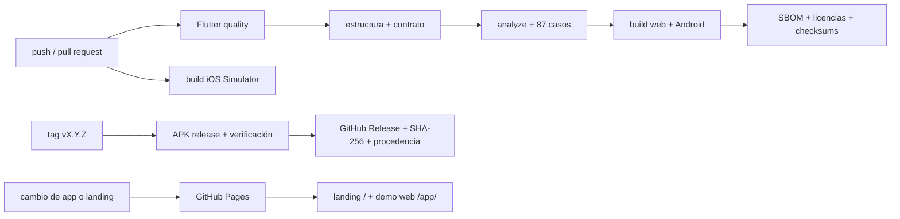

# CI/CD en GitHub Actions

## Vista general



## Workflows

| Workflow | Disparo | Resultado |
|---|---|---|
| [`flutter-ci.yml`](../.github/workflows/flutter-ci.yml) | push a `main`/`develop`, pull request o manual | valida contrato, analiza, prueba, genera SBOM/licencias y compila Android, iOS Simulator y la demo web |
| [`deploy-landing.yml`](../.github/workflows/deploy-landing.yml) | cambios publicables en `main` o manual | compila la demo web, ensambla landing/capturas y despliega GitHub Pages |
| [`android-release.yml`](../.github/workflows/android-release.yml) | tag semántico `vX.Y.Z` | valida la versión, analiza, prueba, compila y verifica el APK, atesta su procedencia y publica el GitHub Release |

## Controles de entrega

1. Flutter queda fijado a 3.44.7 y el lockfile se conserva.
2. Las Actions usan commits SHA inmutables con su versión legible en comentario.
3. CI usa `contents: read`; Pages añade únicamente `pages: write` e
   `id-token: write`.
4. El job principal publica APK instalable de release, demo web, cobertura, SBOM, licencias y
   checksums como artefactos de diagnóstico.
5. Pages se ensambla desde fuentes del mismo commit: landing en `/` y demo web
   no soportada en `/app/` con `base-href` explícito.
6. Un tag cuya versión coincide con `pubspec.yaml` publica el APK, SHA-256 y
   procedencia en GitHub Releases. No publica en tiendas.

## Réplica local

```bash
flutter pub get
python3 tool/bootstrap.py --platforms android,web
uv run --with pyyaml python tool/validate_structure.py --require-lock
python3 tool/verify_rootcause_contract.py
flutter analyze --fatal-infos
flutter test
flutter build web --release
flutter build apk --release
```

En macOS se puede generar `ios` y repetir el build de iOS Simulator. La
ejecución local debe usar la versión declarada en [`.fvmrc`](../.fvmrc).

Windows, macOS y Linux no son targets de aplicación de este producto. El build
web valida el canal de demostración, no una tercera aplicación soportada.

## Qué demuestra y qué no

Un gate verde demuestra que los casos codificados pasan y que los targets
compilan en runners limpios. No demuestra cámara, poca luz, biometría, ciclo de
vida, permisos ni almacenamiento seguro en un dispositivo físico. Esa frontera
está en [`quality/DEVICE_TEST_MATRIX.md`](quality/DEVICE_TEST_MATRIX.md).
