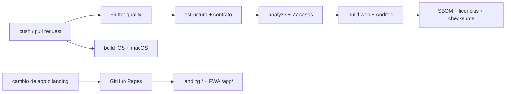

# CI/CD en GitHub Actions

## Vista general



## Workflows

| Workflow | Disparo | Resultado |
|---|---|---|
| [`flutter-ci.yml`](../.github/workflows/flutter-ci.yml) | push a `main`/`develop`, pull request o manual | valida contrato, analiza, prueba, genera SBOM/licencias y compila Android, web, iOS Simulator y macOS |
| [`deploy-landing.yml`](../.github/workflows/deploy-landing.yml) | cambios publicables en `main` o manual | compila la PWA, ensambla landing/capturas y despliega GitHub Pages |

## Controles de entrega

1. Flutter queda fijado a 3.44.7 y el lockfile se conserva.
2. Las Actions usan commits SHA inmutables con su versión legible en comentario.
3. CI usa `contents: read`; Pages añade únicamente `pages: write` e
   `id-token: write`.
4. El job principal publica APK de depuración, web, cobertura, SBOM, licencias y
   checksums como artefactos de diagnóstico.
5. Pages se ensambla desde fuentes del mismo commit: landing en `/` y PWA en
   `/app/` con `base-href` explícito.
6. Ningún workflow de 0.1.0 crea una release firmada ni publica en tiendas.

## Réplica local

```bash
flutter pub get
python3 tool/bootstrap.py --platforms android,web
python3 tool/validate_structure.py --require-lock
python3 tool/verify_rootcause_contract.py
flutter analyze --fatal-infos
flutter test
flutter build web --release
flutter build apk --debug
```

En macOS se pueden generar `ios,macos` y repetir el build de iOS Simulator y
macOS. La ejecución local
debe usar la versión declarada en [`.fvmrc`](../.fvmrc).

## Qué demuestra y qué no

Un gate verde demuestra que los casos codificados pasan y que los targets
compilan en runners limpios. No demuestra cámara, poca luz, biometría, ciclo de
vida, permisos ni almacenamiento seguro en un dispositivo físico. Esa frontera
está en [`quality/DEVICE_TEST_MATRIX.md`](quality/DEVICE_TEST_MATRIX.md).
