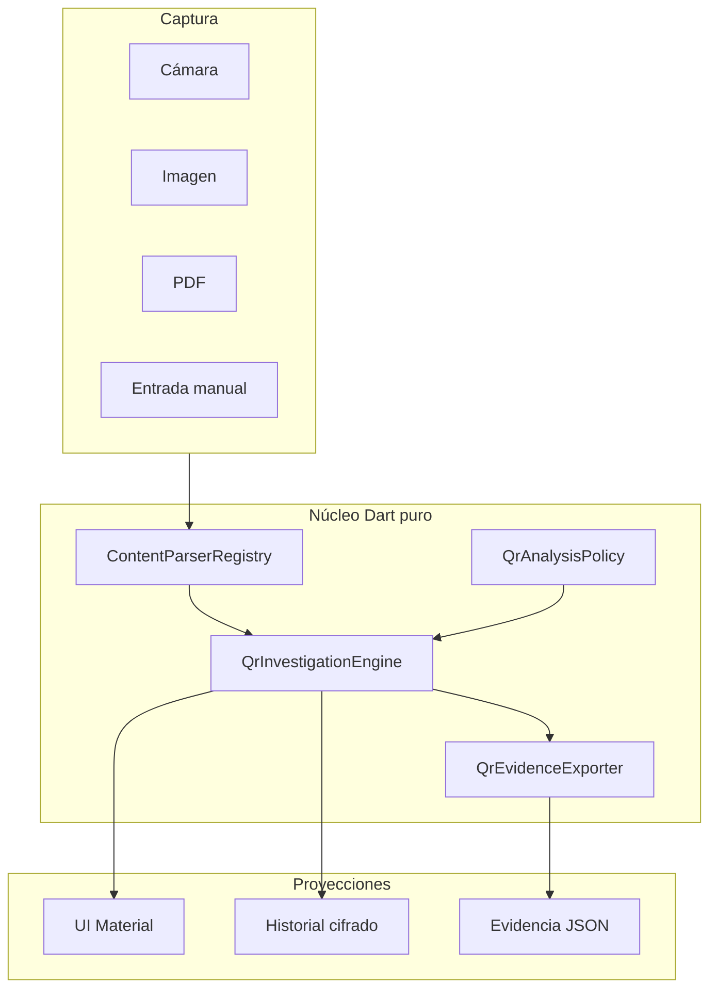
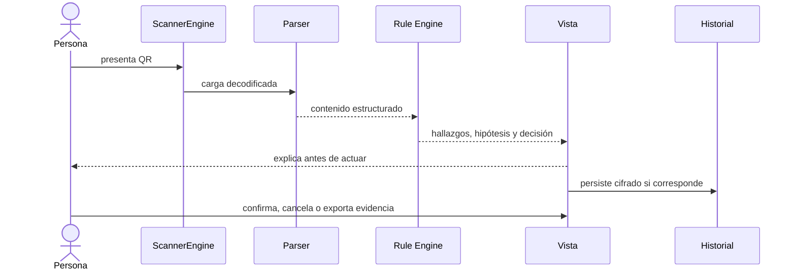

# Arquitectura RootCause

## Principio

La superficie es el código capturado. El motor no parte de “esto es phishing”;
parte de observaciones reproducibles y solo después propone hipótesis.



## Contratos

### Observación

`ScanRecord` conserva:

- carga y valor de presentación;
- simbología y fuente;
- contenido interpretado;
- instante de captura;
- investigación completa;
- metadatos del usuario.

El registro vive cifrado mediante AES-256-GCM. El adaptador `RiskLevel` sigue
existiendo para filtros e importaciones heredados, pero su fuente de verdad es
`QrInvestigation.severity`.

### Hallazgo

`QrFinding` es un dato neutral al idioma:

```text
id · severity · score · confidence · category · evidence[]
```

Un hallazgo expresa una propiedad observada o derivada directamente de la
carga. La UI obtiene título, explicación y recomendación desde
`QrFindingText`; el JSON conserva el id.

### Hipótesis

`QrInvestigation.hypotheses` contiene explicaciones que requieren investigación
humana. Nunca sustituyen a los hallazgos que las sustentan.

### Decisión

`QrActionDecision` tiene cuatro estados:

| Estado | Semántica |
|---|---|
| `allow` | la URI es interpretable y ninguna regla aplicable disparó |
| `confirm` | la URI es interpretable, pero exige decisión explícita |
| `inspectOnly` | el contenido se explica, pero no existe una acción externa segura |
| `block` | la semántica de ejecución es inválida, desconocida o ambigua |

`allow` no significa “seguro”; solo describe la política local de acción.

## Flujo de una lectura



## Pureza y testabilidad

`QrInvestigationEngine.analyze` no depende de Flutter, cámara, base de datos ni
red. Sus entradas son carga, contenido interpretado, política e instante. Su
salida es una entidad serializable. Esto permite:

- pruebas unitarias sin dispositivo;
- fixtures sintéticos;
- comparación determinista entre versiones;
- reutilización futura por CLI o backend local;
- integración con un esquema común RootCause.

## Política organizacional

`QrAnalysisPolicy` centraliza límites y marcas confiables. No se codifican
marcas reales en el motor. Cada `QrTrustedBrand` declara tokens y hosts
permitidos; un token fuera de esos hosts produce `brand-domain-mismatch`.

La política no consulta internet y no reemplaza una fuente de reputación.

## Evidencia e integridad

`QrEvidenceExporter` crea un objeto `rootcause.evidence.qr.v1` y calcula:

```text
bundleHash = SHA-256(JSON_con_claves_ordenadas_sin_bundleHash)
```

Opcionalmente incluye `previousEvidenceHash` para formar una secuencia externa.
La aplicación exporta un paquete individual; no afirma mantener una cadena
automática entre todos los registros en 0.1.1. Un hash sin clave puede
recalcularse después de modificar el archivo: prueba consistencia frente a una
huella anclada externamente, no origen ni autenticidad. El contrato lo marca
como `checksum-only-not-authenticated`.

La carga cruda, los campos interpretados y `effectiveUri` se omiten por defecto.
Así, una consulta o credencial no reaparece por una ruta secundaria. El hash
permite correlacionar dos eventos sin revelar el secreto que contenía el QR.

## Persistencia heredada

- Sembast en plataformas nativas.
- IndexedDB en Web.
- AES-256-GCM por registro.
- llave en Keychain/Keystore mediante `flutter_secure_storage`.
- migraciones transaccionales y recuperación por registro.
- OTP y Wi-Fi con contraseña no se guardan automáticamente.

## Compatibilidad

La importación acepta:

- `RootCause QR Inspector`;
- `Universal Code Scanner`;
- listas heredadas sin sobre.

Todo registro importado se trata como entrada no confiable: id, puntaje,
hallazgos y decisión se recalculan con el motor actual y el instante original.
Un respaldo no puede imponer campos derivados. La versión del motor queda en la
nueva investigación; no se finge que el hallazgo existía en la versión
histórica.

## Fronteras de extensión

| Frontera | Implementación actual | Extensión prevista |
|---|---|---|
| Captura | `MobileScannerEngine` | Android/iOS; escritorio fuera del alcance del producto |
| Parser | `ContentParserRegistry` | parsers firmados por formato |
| Política | API Dart + ejemplo JSON | carga, firma y administración en UI |
| Reputación | ninguna | proveedor opt-in con privacidad separada |
| Correlación | export manual | `rootcause-schema` + motor de fusión |

Ninguna extensión futura debe convertir un dato ausente en un valor favorable:
**regla no evaluable = regla omitida y límite declarado**.
