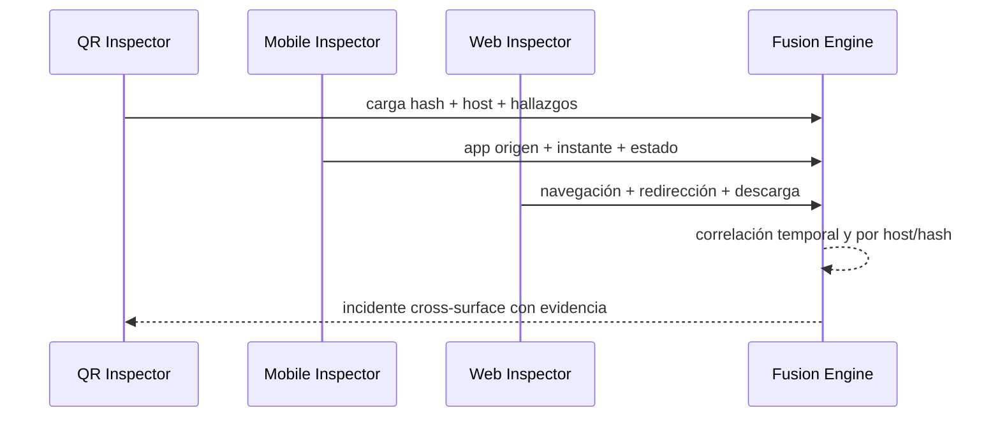

# Integración con RootCause

## Posición en la familia

| Producto | Superficie observable |
|---|---|
| RootCause Windows Inspector | procesos, persistencia, servicios, red y recursos Windows |
| RootCause Mobile Inspector | recursos, apps, permisos y comportamiento móvil |
| RootCause Web Inspector | navegador, sesiones, extensiones, permisos y descargas |
| RootCause QR Inspector | carga opaca transportada por QR/código |

La amenaza no define el producto. Un incidente de phishing por QR puede cruzar
las cuatro superficies.

## Secuencia de correlación futura

## Contrato 0.1.1

La integración disponible hoy es explícita:

1. QR Inspector exporta `rootcause.evidence.qr.v1`.
2. Otro producto o una persona conserva el JSON.
3. La correlación usa `payloadSha256`, `observedAt`, `normalizedHost`, ids de
   hallazgo y `bundleHash`.

Los nuevos registros serializan sus instantes en UTC. Los respaldos heredados
que guardaron una hora local sin offset no permiten reconstruir con certeza la
zona original; esa ambigüedad debe conservarse al correlacionar.

No existe sincronización automática, servidor propio ni bus local entre apps.

## Mapeo recomendado a un esquema común

| Campo QR | Campo común futuro |
|---|---|
| `bundleId` | `event.id` |
| `observedAt` | `event.observed_at` |
| `observation.source` | `observer.source` |
| `observation.symbology` | `surface.attributes.symbology` |
| `observation.payloadSha256` | `artifact.hash.sha256` |
| `investigation.normalizedHost` | `network.destination.domain` |
| `investigation.findings[].id` | `finding.rule_id` |
| `investigation.verdict.severity` | `finding.max_severity` |
| `investigation.hypotheses[]` | `hypothesis.id` |
| `integrity.bundleHash` | `evidence.integrity.sha256` |

## Eventos útiles para correlación

- QR capturado → navegador abre el mismo host dentro de 60 segundos.
- `download-dangerous-extension` → RootCause Web observa descarga con mismo
  nombre/hash.
- `host-private-or-local` → RootCause Mobile/Windows observa vecino nuevo o
  conexión al mismo destino.
- `payment-instruction` → nueva dirección beneficiaria respecto de una
  política empresarial.
- `scheme-blocked` → intento repetido desde varias fuentes.

Coincidencia temporal o de dominio no demuestra causalidad. El motor de fusión
debe conservar cada evento original y declarar el criterio exacto usado.

## Reglas de privacidad

- correlacionar por hash antes que por carga cruda;
- no enviar OTP, contraseñas Wi-Fi, datos AAMVA ni direcciones de pago sin una
  decisión explícita;
- separar export local de cualquier proveedor de reputación remoto;
- declarar retención, destino y base legal antes de habilitar sincronización;
- mantener telemetría desactivada por defecto.
