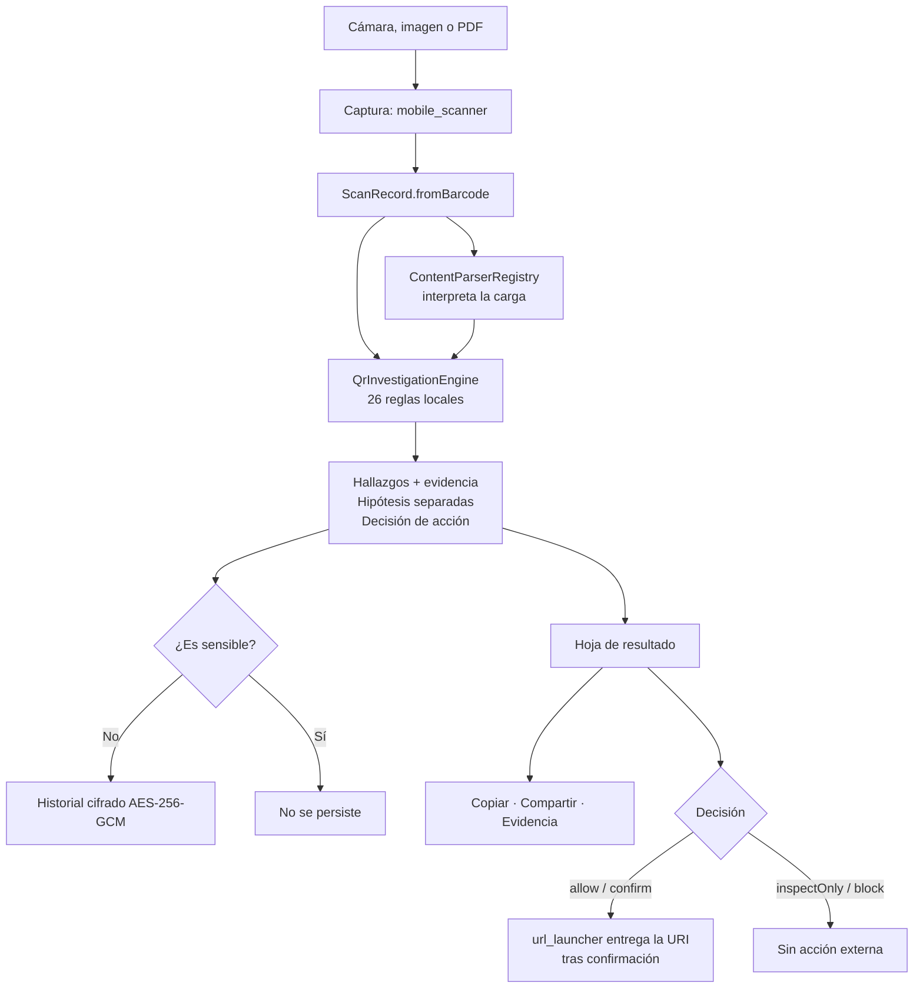

# 01 · Descripción general del sistema

## Qué es

RootCause QR Inspector es una **aplicación móvil escrita en Flutter** que lee
códigos QR y de barras y, antes de permitir cualquier acción, explica qué
contiene el código y qué señales de riesgo observó. Todo el análisis ocurre en
el teléfono: el sistema no tiene servidor, ni cuentas, ni telemetría.

Pertenece a una familia de productos llamada RootCause, organizada por
**superficie observable**. Esta edición observa una sola superficie: el
contenido codificado en un código gráfico y la forma en que ese contenido
intenta convertirse en una acción.

**Comprobado:** `pubspec.yaml` declara `name: rootcause_qr_inspector`,
`version: 0.1.1+2`, y ninguna dependencia de red o analítica. La única
dependencia que abre algo hacia afuera es `url_launcher`, que entrega una URI a
otra aplicación del sistema cuando la persona lo confirma.

## Qué problema resuelve

Un código QR es una **instrucción opaca**. A simple vista no se distingue el
sitio real de una imitación, ni un pago legítimo de una sustitución de
beneficiario. Quien escanea con un lector convencional descubre el destino
cuando ya está dentro de él.

El sistema invierte ese orden:

1. captura la carga sin ejecutarla;
2. la interpreta y muestra sus campos;
3. aplica 26 reglas locales que producen **hechos observables**;
4. deriva **hipótesis** separadas de esos hechos;
5. decide qué acción permite, y solo entonces ofrece un botón.

El producto no afirma que un destino sea seguro. Una lectura sin hallazgos
significa exactamente «ninguna regla local aplicable disparó», y la interfaz lo
dice con esas palabras.

## A quién está dirigido

| Actor | Qué hace con el sistema |
|---|---|
| Persona que recibe un QR dudoso | Lo inspecciona antes de abrirlo y decide con la evidencia a la vista |
| Persona que investiga un incidente | Exporta evidencia redactada con huella SHA-256 para correlacionarla |
| Equipo de operaciones | Cuenta productos con la sesión de inventario y exporta el conteo |
| Organización con marcas propias | Inyecta su política de marcas y dominios permitidos por API |
| Auditor | Revisa reglas, evidencia, cifrado y límites declarados |

No hay roles dentro de la aplicación: **no existe autenticación de usuario ni
separación de permisos**. Quien tiene el teléfono desbloqueado tiene todas las
funciones. El único control de acceso es un bloqueo local opcional con la
biometría o el PIN del dispositivo.

## Casos de uso principales

1. **Inspeccionar un código con la cámara.** Es el flujo central.
2. **Inspeccionar códigos dentro de imágenes o de un PDF.** Por lotes, con
   progreso y cancelación.
3. **Consultar el historial** de casos inspeccionados, buscarlos, filtrarlos por
   riesgo, anotarlos y etiquetarlos.
4. **Exportar evidencia** de un caso en formato redactado y verificable.
5. **Contar inventario** leyendo códigos de producto de forma continua.
6. **Generar códigos** localmente para pruebas o para compartir datos.
7. **Recuperar registros dañados** y rotar la llave de cifrado.

## Funcionalidades principales

| Funcionalidad | Dónde vive | Estado |
|---|---|---|
| Lectura con cámara | `lib/features/scanner/scanner_screen.dart` | Activo |
| Lectura desde imagen y PDF | mismo archivo + `lib/services/pdf_page_renderer_io.dart` | Activo · PDF no disponible en web |
| Interpretación de contenido | `lib/services/content_interpreter.dart` | Activo |
| Motor de 26 reglas | `lib/core/investigation/qr_investigation_engine.dart` | Activo |
| Resultado explicado | `lib/features/result/scan_result_sheet.dart` | Activo |
| Evidencia exportable | `lib/core/investigation/qr_evidence_exporter.dart` | Activo |
| Historial cifrado | `lib/services/history_repository.dart` | Activo |
| Inventario | `lib/features/inventory/inventory_screen.dart` | Activo |
| Generador | `lib/features/generator/generator_screen.dart` | Activo |
| Centro de recuperación | `lib/features/recovery/recovery_screen.dart` | Activo |
| Rotación de llave | `lib/core/security/data_maintenance_service.dart` | Activo |
| Política de marcas | `lib/core/investigation/qr_analysis_policy.dart` | Parcial: existe la API, no la pantalla |
| Banderas de capacidades futuras | `lib/core/feature_flags/feature_flags.dart` | Inactivo por diseño |

## Flujo general de funcionamiento

**Explicación del diagrama.** La captura produce una carga cruda. Esa carga
recorre dos caminos que convergen: el intérprete, que la convierte en campos
legibles, y el motor de reglas, que produce hechos. El motor recibe además el
resultado del intérprete, porque tres de sus reglas dependen del tipo de
contenido. El resultado se muestra siempre; se guarda solo si no es sensible y
la persona no desactivó el historial. La acción externa nunca es automática:
depende de la decisión del motor y de una confirmación.

## Entradas y salidas

| Entrada | Origen | Confianza |
|---|---|---|
| Carga de un código | Cámara, galería, PDF | No confiable: es el objeto de análisis |
| Respaldo JSON de historial | Archivo elegido por la persona | **No confiable**: todo campo derivado se recalcula |
| Respaldo JSON de inventario | Archivo elegido por la persona | No confiable: se valida antes de importar |
| Política de análisis | API Dart de un integrador | Confiable: la aporta quien integra |
| Preferencias | Almacén del sistema | Confiable con valores por defecto conservadores |

| Salida | Formato | Contiene la carga |
|---|---|---|
| Evidencia de un caso | JSON `rootcause.evidence.qr.v1` | **No**, salvo decisión explícita por API |
| Historial completo | JSON, CSV, XLSX | **Sí**, en claro. La interfaz lo advierte |
| Sesión de inventario | JSON, CSV, XLSX | Sí: códigos de producto |
| Paquete de recuperación | JSON | Solo cargas ya cifradas, sin la llave |
| Diagnóstico privado | JSON | No: solo tipo de error y huella de pila |
| Código generado | PNG, SVG | Sí: lo escribió la persona |

## Componentes más importantes

1. **`QrInvestigationEngine`** — el motor de reglas. Es una función pura sin
   dependencias de Flutter, cámara, base de datos ni red. Es el corazón del
   producto y la razón de que pueda probarse sin dispositivo.
2. **`ScanRecord`** — la entidad que une carga, interpretación e investigación.
3. **`PayloadCipher`** — el cifrado AES-256-GCM de todo lo que se persiste.
4. **`QrEvidenceExporter`** — el paquete forense redactado y verificable.
5. **`ScannerScreen`** — la pantalla que reconcilia cámara, ciclo de vida,
   estados visibles y lotes cancelables.

## Tecnologías utilizadas

| Capa | Tecnología | Versión |
|---|---|---|
| Lenguaje | Dart | `>=3.12.0 <4.0.0` |
| Framework | Flutter | `>=3.44.0`, fijado a 3.44.7 en `.fvmrc` |
| Base de datos | Sembast (archivo) / sembast_web (IndexedDB) | 3.8.9+1 / 2.4.5+1 |
| Cifrado | `cryptography` (AES-GCM 256) | 2.9.0 |
| Almacén de llaves | `flutter_secure_storage` | 11.0.0 |
| Captura | `mobile_scanner` | 7.4.0 |
| Generación de códigos | `barcode_widget` | 2.0.4 |
| PDF | `pdfrx` | 2.4.5 |
| Hojas de cálculo | `excel` | 4.0.6 |
| Automatización | Python 3.12 + GitHub Actions | — |

Lista completa en `pubspec.yaml`. Dos versiones están ancladas a propósito y no
deben subirse sin resolver antes un conflicto de resolución: ver
[`../quality/LOCKFILE.md`](../quality/LOCKFILE.md).

## Límites del sistema

Lo que el sistema **no puede** hacer, por diseño y por falta de red:

- conocer la reputación, el dueño o la antigüedad de un dominio;
- resolver DNS o ver el certificado TLS que servirá el destino;
- seguir la cadena real de redirecciones HTTP;
- descargar y analizar el archivo al que apunta una ruta;
- detectar que alguien pegó una etiqueta falsa sobre un QR auténtico;
- confirmar que un beneficiario bancario es el esperado.

Estas ausencias se emiten como una lista explícita en cada investigación
(`limitations`) y se muestran en la interfaz. Detalle completo en
[`../rootcause/LIMITATIONS.md`](../rootcause/LIMITATIONS.md).

## Integraciones externas

**No hay ninguna integración de red.** El sistema no llama a ninguna API. Sus
únicas fronteras externas son servicios del sistema operativo:

| Frontera | Para qué |
|---|---|
| Cámara | Capturar códigos |
| Galería / selector de archivos | Leer imágenes, PDF y respaldos JSON |
| Keychain / Keystore | Guardar la llave de cifrado |
| Autenticador local | Bloqueo biométrico opcional |
| Portapapeles | Copiar una carga, con borrado programado |
| Hoja de compartir | Entregar exportaciones a otra aplicación |
| `url_launcher` | Abrir una URI en otra aplicación, tras confirmación |

## Estado general observado en el repositorio

**Comprobado en el commit analizado:**

- el código fuente está completo y es coherente: los verificadores
  `tool/validate_structure.py` y `tool/verify_rootcause_contract.py` pasan;
- hay 88 casos de prueba declarados;
- el APK Android se publica desde un tag mediante GitHub Actions;
- las carpetas nativas no están versionadas: se generan de forma reproducible.

**Requiere validación:** el comportamiento en dispositivo físico —cámara,
biometría, almacén seguro, ciclo de vida— y, en particular, las correcciones de
lectura de la versión 0.1.1.

**No identificado:** ninguna publicación en Play Store o App Store, ninguna
firma comercial, ningún paquete instalable de iOS.

---

## El sistema explicado para una persona no técnica

Imagine un código QR pegado en la mesa de un restaurante, en un cartel de la
calle o llegado por mensaje. Es un cuadrado de puntos: **nadie puede leerlo con
los ojos**. Al escanearlo con la cámara normal del teléfono, este suele abrir
directamente lo que el código diga, y solo entonces se descubre adónde llevaba.

Esta aplicación hace otra cosa. Lee el código, pero **no lo abre**. En su lugar
muestra una ficha con lo que encontró dentro: si es una dirección web, cuál es
exactamente; si es una red Wi-Fi, cuál; si es una instrucción de pago, a quién.

Después revisa esa información con una lista de 26 comprobaciones. Cada una es
una pregunta concreta, del estilo de:

- ¿la dirección usa una conexión sin cifrar?
- ¿el nombre del sitio mezcla alfabetos para parecerse a otro?
- ¿hay una segunda dirección escondida dentro de la primera?
- ¿la ruta termina en un archivo que puede instalar algo?

Cada respuesta afirmativa es un **hecho**: algo que la aplicación observó de
verdad. A partir de esos hechos propone una **sospecha** —por ejemplo, «podría
ser un intento de suplantación»— y la presenta como lo que es: una sospecha que
merece revisión, no una acusación ni una certeza.

Solo al final ofrece un botón para continuar, y a veces ni siquiera eso: si la
dirección está tan mal formada que otra aplicación podría interpretarla de forma
distinta, el botón no aparece.

Tres cosas importantes, dichas sin rodeos:

1. **Que no encuentre nada no significa que el sitio sea seguro.** Significa que
   ninguna de sus 26 comprobaciones se activó. La aplicación lo dice con esas
   palabras cada vez.
2. **Nada sale del teléfono.** No hay cuenta, no hay servidor, no hay publicidad
   ni estadísticas. Lo que se guarda queda cifrado en el propio dispositivo.
3. **No sustituye a un antivirus ni a su banco.** Ante un pago o una contraseña,
   la aplicación insiste en verificar por otra vía.

Si algo parece sospechoso, la aplicación puede generar un **informe** para
compartir con alguien de confianza. Ese informe, a propósito, **no incluye el
enlace completo**: lleva una huella digital del contenido, la lista de lo que se
observó y lo que no se pudo comprobar. Así se puede pedir ayuda sin reenviar por
accidente la contraseña, el código de acceso o los datos de pago que el código
llevaba dentro.
