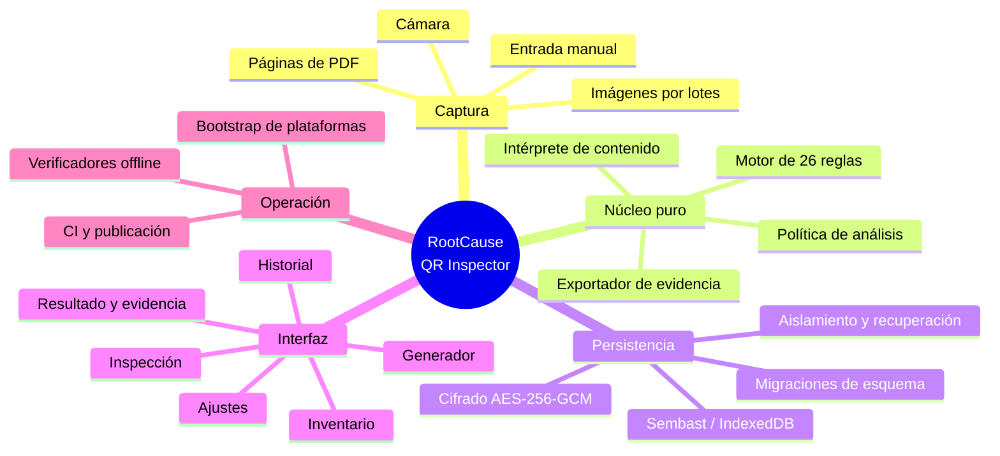
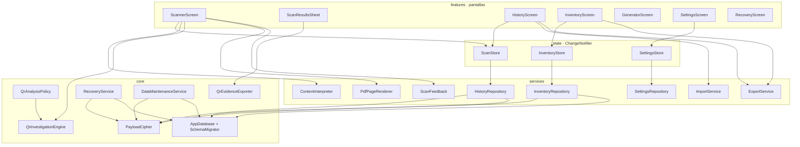
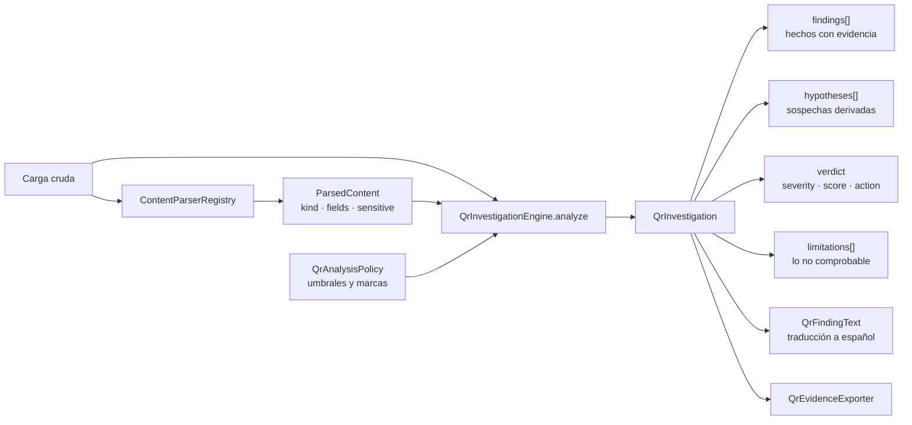
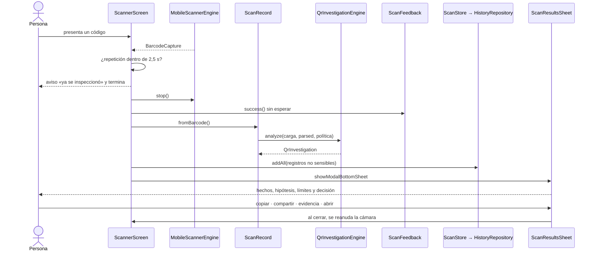
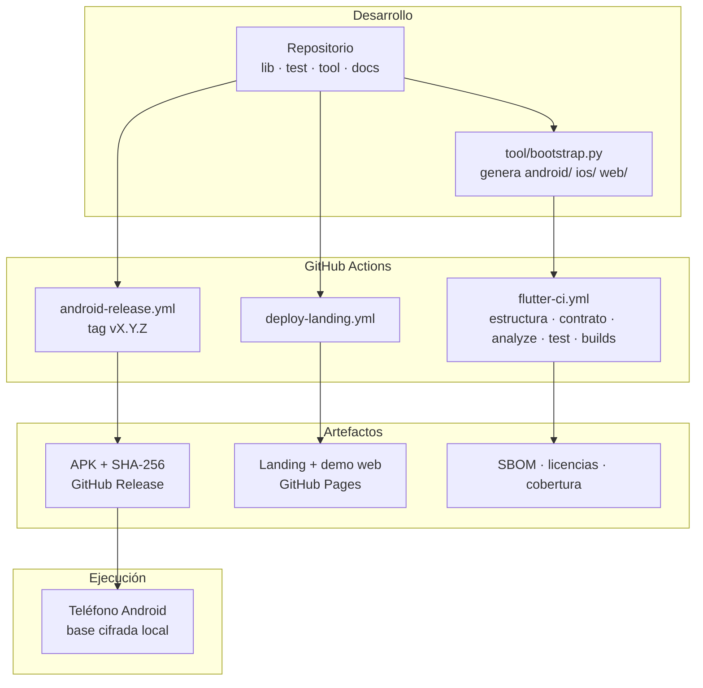

# 03 · Arquitectura

## Estilo arquitectónico

Es una **aplicación monolítica cliente, en capas, con un núcleo puro**. No hay
servidor, no hay microservicios, no hay comunicación entre procesos.

La decisión estructural que define todo lo demás: **el motor de análisis no
depende de Flutter**. `QrInvestigationEngine.analyze` recibe una cadena, una
interpretación, una política y un instante, y devuelve un objeto serializable.
No toca cámara, base de datos, red ni widgets. Por eso puede probarse sin
dispositivo, compararse entre versiones y, en el futuro, reutilizarse desde una
CLI o un backend.

El resto de la aplicación son **proyecciones** de ese núcleo: la interfaz lo
dibuja, la base de datos lo cifra y lo guarda, el exportador lo convierte en un
paquete portable.

## Mapa mental del sistema



**Explicación.** Cuatro bloques sostienen el sistema y uno lo rodea. Captura
alimenta al núcleo; el núcleo produce datos que la persistencia guarda cifrados
y la interfaz muestra. Operación no es parte de la aplicación en ejecución: es
el andamiaje que garantiza que lo que se compila coincide con lo que se
documenta.

## Capas y responsabilidades

| Capa | Directorio | Responsabilidad | Puede depender de |
|---|---|---|---|
| Modelos | `lib/models/` | Entidades inmutables y su serialización | Solo de otros modelos y del núcleo de investigación |
| Núcleo | `lib/core/` | Investigación, seguridad, base de datos, recuperación, tema, localización, diagnóstico | Modelos |
| Servicios | `lib/services/` | Interpretación, repositorios, importación, exportación, plataforma | Núcleo, modelos |
| Estado | `lib/state/` | Stores `ChangeNotifier` que la interfaz observa | Servicios, modelos |
| Funcionalidades | `lib/features/` | Pantallas y widgets por caso de uso | Todo lo anterior |
| Arranque | `lib/main.dart`, `bootstrap.dart`, `bootstrap_host.dart`, `app.dart` | Composición y ciclo de vida de la aplicación | Todo |

La dirección de las dependencias es estricta y la comprueba
`tool/validate_structure.py`, que falla si un `import` local apunta a un archivo
inexistente. **Nada en `lib/core/investigation/` importa Flutter**, lo que se
puede verificar con:

```bash
grep -rl "package:flutter" lib/core/investigation/
```

que no devuelve el motor ni el contrato.

## Diagrama de arquitectura



**Explicación.** Las pantallas nunca hablan con la base de datos: pasan por un
store, y el store por un repositorio. La única excepción deliberada es el
análisis: `ScannerScreen` construye un `ScanRecord`, y ese constructor invoca
directamente al intérprete y al motor, porque ambos son funciones puras sin
estado que compartir. El cifrado está por debajo de todos los repositorios: no
existe camino que escriba en la base sin pasar por `PayloadCipher`.

## Diagrama de componentes del núcleo de investigación



**Explicación.** El motor recibe tres entradas y produce una sola salida
serializable. Los identificadores de hallazgo son estables y neutrales al
idioma; `QrFindingText` es la única capa que los convierte en español, de modo
que traducir la interfaz nunca altera el formato de evidencia. El exportador
consume la investigación, no la interfaz.

## Flujo principal, paso a paso



**Explicación.** Tres detalles del diagrama son decisiones de diseño, no
casualidades. Primero, el filtro de repetición ocurre **antes** de cualquier
trabajo, y cuando descarta algo lo dice. Segundo, la confirmación sonora se
lanza sin esperarla: si el reproductor de audio tarda, el resultado no espera.
Tercero, el guardado ocurre antes de mostrar la hoja, y solo con los registros
que no son sensibles.

## Diagrama de despliegue



**Explicación.** El repositorio no contiene binarios de producto; los produce la
CI. Un tag semántico dispara la publicación del APK con su checksum y su
atestación de procedencia. La landing y la demo web se despliegan por separado y
no son plataformas del producto.

## Patrones de diseño identificados

| Patrón | Dónde | Por qué |
|---|---|---|
| Repositorio | `HistoryRepository`, `InventoryRepository`, `RecoveryRepository`, `SettingsRepository` | Aísla el almacenamiento del resto |
| Observador | Los tres stores extienden `ChangeNotifier` | La interfaz se redibuja sola |
| Estrategia + registro | `ContentParser` y `ContentParserRegistry` | Permite añadir formatos sin tocar el intérprete |
| Adaptador | `ScannerEngine` sobre `mobile_scanner`; `ScanSecurityAnalyzer` sobre el motor | Cambiar el paquete de captura no toca persistencia; el adaptador conserva `RiskLevel` para pantallas heredadas |
| Fábrica con nombre | `ScanRecord.fromBarcode`, `.manual`, `.fromJson` | Tres orígenes con reglas distintas de confianza |
| Objeto de valor inmutable | Todos los modelos, con `copyWith` | Evita mutación compartida |
| Sobre versionado | `PayloadCipher` | Permite evolucionar el cifrado sin perder lo escrito |
| Cola serial | `AsyncWriteQueue` | Ordena escrituras concurrentes de inventario |
| Testigo de cancelación | `CancellationToken` | Cancelación cooperativa de lotes |
| Compilación condicional | `database_opener.dart`, `pdf_page_renderer.dart` | Una implementación por plataforma, sin `if (kIsWeb)` disperso |

## Manejo de estado

No se usa ninguna librería de gestión de estado. Hay tres stores
`ChangeNotifier` creados una sola vez en el arranque y pasados hacia abajo por
constructor:

| Store | Qué contiene | Cuándo notifica |
|---|---|---|
| `ScanStore` | Historial descifrado y ordenado, estado de carga y de migración | **Después** de persistir |
| `InventoryStore` | Sesiones y sesión activa | Después de persistir, dentro de la cola serial |
| `SettingsStore` | Preferencias | **Antes** de persistir |

La diferencia de orden es deliberada. Un cambio de historial o inventario no
debe mostrarse como confirmado si la base todavía no lo escribió; un cambio de
tema, en cambio, debe verse al instante y su escritura no puede corromper datos.

No hay inyección de dependencias ni localizador de servicios: `AppServices`
agrupa lo que se construyó y se entrega por constructor. Es más verboso y hace
explícitas las dependencias de cada pantalla.

## Procesos síncronos y asíncronos

| Proceso | Naturaleza | Nota |
|---|---|---|
| Análisis de una carga | Síncrono y puro | Milisegundos; sin E/S |
| Cifrado y descifrado | Asíncrono | Preparado **fuera** de la transacción |
| Lectura del historial | Asíncrono | Descifra registro a registro y aísla los ilegibles |
| Lote de imágenes o PDF | Asíncrono cancelable | Con progreso, `await Future.delayed(Duration.zero)` para ceder el hilo |
| Codificación de CSV y XLSX | Isolate (`compute`) | Un historial grande bloquearía la interfaz |
| Escrituras de inventario | Serializadas | `AsyncWriteQueue` |
| Rotación de llave | Asíncrona, en dos fases | Reencripta en memoria y luego escribe en una transacción |

## Manejo de errores

Cuatro niveles, de fuera hacia dentro:

1. **Zona guardada** — `main()` envuelve `runApp` en `runZonedGuarded`, e
   instala `FlutterError.onError` y `PlatformDispatcher.instance.onError`. Todo
   error no capturado llega a `AppDiagnostics`.
2. **Arranque** — si `AppBootstrapper.initialize` falla, `BootstrapHost` muestra
   la pantalla `Inicio seguro` con cuatro salidas: reintentar, abrir sin datos
   persistentes, restablecer preferencias visuales o copiar el diagnóstico.
3. **Por operación** — la cámara traduce cualquier excepción a un estado
   visible; el descifrado que falla aísla el registro en vez de propagarse; la
   importación cuenta el registro rechazado y continúa.
4. **Diagnóstico** — `AppDiagnostics` guarda como máximo 100 entradas con
   instante, área, tipo de error y huella de las cuatro primeras líneas de la
   pila. **No guarda el mensaje de la excepción**, porque un mensaje puede
   arrastrar una ruta, una consulta o un valor de la persona.

## Autenticación y autorización

- **No hay autenticación de usuario ni modelo de permisos.** No hay cuentas,
  roles ni servidor que autorizar.
- Existe un **bloqueo local opcional** (`BiometricLockGate`): cuando está
  activo, la aplicación se bloquea al perder el primer plano —`inactive`,
  `paused`, `hidden` o `detached`— y exige autenticarse con el método del
  dispositivo. Sin salida alternativa: si falla, solo se puede reintentar.
- La autorización real que existe es **sobre acciones, no sobre personas**:
  `QrActionDecision` decide si una carga puede entregarse a otra aplicación.

## Persistencia y caché

| Qué | Dónde | Cifrado |
|---|---|---|
| Historial | Almacén `scan_history` de Sembast | Sí, carga completa |
| Inventarios | Almacén `inventory_sessions` | Sí, carga completa |
| Incidencias de recuperación | Almacén `recovery_issues` | Conserva el sobre original |
| Metadatos de esquema | Almacén `_schema_meta` | No: solo números y marcas |
| Llave activa | Almacén `_security_meta` | No: es un identificador, no la llave |
| Llave de cifrado | Keychain / Keystore | Es el secreto |
| Preferencias | `SharedPreferencesAsync` | No: no contienen carga |

Cachés en memoria: `SecureStorageKeyProvider` cachea llaves ya leídas, y los
stores mantienen la lista descifrada mientras la aplicación vive. No hay caché
en disco de datos descifrados.

## Procesos en segundo plano

**No hay ninguno.** Sin servicios, sin `WorkManager`, sin tareas programadas,
sin notificaciones push. La aplicación solo trabaja mientras está en primer
plano; de hecho, detiene la cámara en cuanto pasa a `inactive`.

Lo más parecido son dos temporizadores en memoria: el borrado del portapapeles
(`ClipboardService`) y los avisos transitorios del escáner. Ambos mueren con el
proceso, y así está declarado.

## Diagrama entidad-relación

El sistema no usa un motor relacional; el equivalente conceptual está en
[07-database.md](07-database.md), junto al diccionario de datos y las
migraciones.

## Fronteras de extensión

| Frontera | Implementación actual | Cómo se extiende |
|---|---|---|
| Motor de captura | `MobileScannerEngine` | Implementar `ScannerEngine` |
| Formatos de contenido | `LegacyContentParser` | `ContentParserRegistry.register` con prioridad mayor que -1000 |
| Política organizacional | `QrAnalysisPolicy` por API | Falta la pantalla de carga y administración |
| Reglas | 26 reglas en el motor | Motor, textos, esquema, fixture, pruebas, documentación y `engineVersion`, todo en la misma entrega |
| Persistencia | Sembast | El opener por compilación condicional |
| Reputación remota | Ninguna | Bandera `urlReputation`, apagada |

Regla que atraviesa todas: **un dato ausente nunca se convierte en un valor
favorable**. Una regla que no puede evaluarse se omite y su límite se declara.
