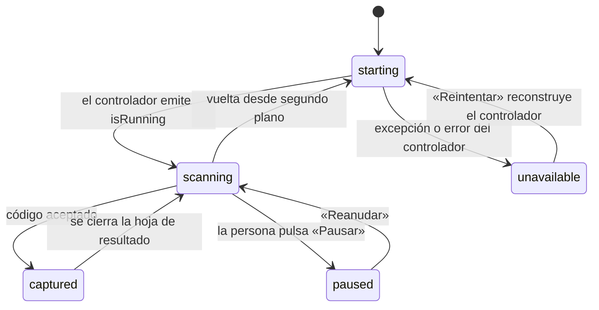

# 06 · Explicación profunda del código

Este documento explica **cómo funciona por dentro** cada módulo importante: su
flujo, sus decisiones condicionales, sus cambios de estado y sus casos límite.
Las funciones triviales —`copyWith`, `toJson` simétricos, etiquetas de
presentación— no se detallan aquí; están inventariadas en
[04-code-map.md](04-code-map.md) y [05-technical-reference.md](05-technical-reference.md).

---

## 1. Arranque: de `main()` a la primera pantalla

**Archivos:** `lib/main.dart`, `lib/bootstrap.dart`, `lib/bootstrap_host.dart`

### Objetivo

Dejar la aplicación en uno de dos estados válidos: funcionando con sus servicios
listos, o mostrando una pantalla de recuperación que permita salir del problema.
Nunca en una pantalla en blanco.

### Flujo

`main()` hace tres cosas antes de dibujar nada:

1. `WidgetsFlutterBinding.ensureInitialized()`;
2. `installGlobalErrorHandlers()`, que engancha `FlutterError.onError` y
   `PlatformDispatcher.instance.onError`;
3. `runZonedGuarded(() => runApp(...), ...)`, que captura los errores asíncronos
   que escapan de todo lo anterior.

El orden importa: los capturadores se instalan **antes** de `runApp`, así que un
fallo durante la construcción del primer widget ya queda registrado.

`AppBootstrapper.initialize` compone el sistema en un orden que no es arbitrario:

```text
1. AppDatabase.open()  o  openTemporary()   → ejecuta SchemaMigrator.migrate()
2. RecoveryRepository(database)
3. EncryptionMetadataRepository(database)
4. activeKeyId = temporary ? 'v2' : await metadata.loadActiveKeyId()
5. PayloadCipher(keyProvider: temporary ? memoria : Keychain, activeKeyId)
6. SettingsStore.initialize()
7. Future.wait([ScanStore.initialize(), InventoryStore.initialize()])
8. scans.pruneOlderThan(settings.value.historyRetentionDays)
```

**Por qué ese orden.** El paso 4 lee el identificador de llave activa **desde la
base de datos**, no desde preferencias: si una rotación anterior se interrumpió,
la base es la única fuente que coincide con los registros ya reescritos. El paso
5 no puede ocurrir antes, porque necesita ese identificador. El paso 8 va al
final porque necesita la preferencia de retención ya cargada.

### Decisiones condicionales

```dart
if (temporary) {
  try { await settings.initialize(); } on Object { /* ... */ }
} else {
  await settings.initialize();
}
```

En modo temporal, un fallo al leer preferencias **se ignora**. Es deliberado: ese
modo existe precisamente para arrancar cuando el almacenamiento del sistema no
responde. En modo normal el mismo fallo sí se propaga, porque significa que algo
está roto y la persona debe saberlo.

### Tratamiento de errores

```dart
} on Object {
  await database?.close();
  rethrow;
}
```

Cualquier excepción cierra la base antes de relanzar. Sin esto, un reintento
encontraría el archivo abierto por la instancia anterior.

`BootstrapHost` captura ese error y construye `StartupFailure`, que reduce el
fallo a **tipo de error y huella de las cuatro primeras líneas de la pila**. El
mensaje mostrado es fijo y no proviene de la excepción, porque un mensaje puede
arrastrar una ruta de archivo o un valor de la persona.

### Casos límite

- **Base corrupta o permisos denegados:** «Inicio seguro» con cuatro salidas.
- **Modo temporal:** `MemoryEncryptionKeyProvider` y base en memoria con nombre
  único por microsegundo. Nada de esa sesión es recuperable después.
- **Preferencias corruptas:** «Restablecer preferencias visuales» borra 14
  claves y conserva `save_history`, `private_mode` y `biometric_lock`.

---

## 2. El motor de reglas

**Archivo:** `lib/core/investigation/qr_investigation_engine.dart`

### Objetivo

Convertir una carga en hechos observables, sin red y de forma determinista.

### Entrada y salida

Entra `(rawValue, parsed?, policy, analyzedAt?)`. Sale un `QrInvestigation`.

### Flujo interno, bloque a bloque

**Bloque 0 — preparación.**

```dart
final String value = rawValue.trim();
final String lower = value.toLowerCase();
```

La copia de trabajo se recorta para que el parser de URI tolere espacios
accidentales. **La huella, en cambio, se calcula sobre `rawValue` sin recortar**:

```dart
payloadSha256: sha256.convert(utf8.encode(rawValue)).toString(),
```

Es una decisión de seguridad. Dos códigos visualmente idénticos que difieran en
un byte invisible producen huellas distintas, que es justo lo que una
investigación necesita distinguir. Una prueba lo fija: `analyze('\nhttps://…\n')`
debe tener distinta huella que la versión limpia, y además disparar
`url-control-character`.

**Bloque 1 — clasificación de la carga.**

```dart
final String? declaredScheme = _declaredScheme(value);
final bool safeAction = declaredScheme != null && _safeActionSchemes.contains(declaredScheme);
final Uri? webUri = _toWebUri(value);
```

`_toWebUri` antepone `https://` si la carga empieza por `www.`, y devuelve `null`
si el esquema resultante no es `http` ni `https`. `_safeActionSchemes` contiene
`mailto`, `tel`, `sms`, `smsto` y `geo`: son acciones que pueden entregarse a
otra aplicación pero no son web.

**Bloque 2 — reglas independientes del host.**

`url-control-character` se evalúa para cualquier URI accionable, no solo web. Es
la única regla que examina `rawValue` en lugar de la copia recortada, y detecta:

- runas de control (`< 0x20`, `0x7F`);
- espacios de ancho cero y BOM (`200B`, `200C`, `200D`, `FEFF`);
- controles bidireccionales (`202A`–`202E`, `2066`–`2069`);
- sus equivalentes codificados en porcentaje (`%00`–`%1f`, `%7f`, `%e2%80%8b`,
  `%ef%bb%bf`).

Dispara `forceBlock`. El motivo: un control bidireccional puede hacer que una
URI se **muestre** de una forma y se **interprete** de otra.

`sensitive-secret`, `payment-instruction` y `opaque-binary-payload` dependen del
tipo de contenido que aportó el intérprete, con una comprobación de prefijo como
respaldo por si el intérprete no estuviera disponible.

`scheme-blocked` solo se evalúa cuando no hay URI web **ni** acción segura, y
solo dispara si el esquema no está en la lista de estructuras conocidas
(`wifi`, `otpauth`, `bitcoin`, `mecard`, `begin`, `binary-base64`…). Es la regla
que bloquea `javascript:` y cualquier esquema de aplicación desconocido.

**Bloque 3 — reglas de URL.** Solo se ejecutan si `webUri != null`. Trabajan
sobre tres vistas distintas de la misma URL, y la distinción es importante:

| Vista | Cómo se obtiene | Quién la usa |
|---|---|---|
| `webUri.host` normalizado | El parser de Dart | Punycode, mixed-script, IP, acortador, subdominios |
| `_rawAuthority(value)` | Texto entre `://` y el primer `/`, `#` o `?` | `authority-obfuscated`, `encoded-separator`, `host-trailing-dot` |
| `_safeDecode(webUri.path)` | Ruta decodificada, tolerante a error | `download-dangerous-extension` |

Usar la autoridad **cruda** es lo que permite detectar `\`, espacios o varios
`@`: el parser normalizado ya los habría absorbido o reinterpretado.

**Bloque 4 — agregación.**

```dart
severity = hay algún critical ? critical : hay algún warning ? warning : normal
score    = suma de pesos, acotada a [0, 100]
```

La severidad **no** se deriva del puntaje. El puntaje ordena evidencia; no es una
probabilidad.

**Bloque 5 — decisión.**

```dart
if (forceBlock)            action = block;
else if (webUri != null)   action = findings.isEmpty ? allow : confirm;
else if (safeAction)       action = confirm;
else                       action = inspectOnly;
```

Una URL crítica pero interpretable queda en `confirm`, no en `block`. La razón:
bloquear no significa «malicioso», significa «no puedo entregar esto sin
ambigüedad». Un dominio con Punycode es entregable; una autoridad con dos `@`
no lo es.

**Bloque 6 — hipótesis.** Se derivan de conjuntos de ids, nunca del puntaje, y
**no suman puntos**. `credential-theft-suspected` exige la coexistencia de
`credential-lure-path` con una señal de identidad o de ocultación de destino:
sin esa condición, cualquier página de acceso legítima la dispararía.

### Casos límite tratados

| Caso | Tratamiento |
|---|---|
| Host que empieza por `fc` | `_isPrivateOrLocalHost` exige `h.contains(':')` antes de mirar prefijos IPv6, así que `fca.example` no se confunde con una IPv6 privada. Hay una prueba dedicada |
| Ruta con codificación inválida | `_safeDecode` captura `FormatException` y devuelve el original |
| Parámetro de redirección relativo al protocolo | `//host/x` se completa con el esquema visible antes de comparar |
| Redirección al mismo dominio | `_sameHostFamily` compara por sufijo; no dispara si comparten familia |
| Token de marca demasiado corto | Se ignora por debajo de 4 caracteres alfanuméricos |
| Hallazgo repetido | `_FindingCollector` deduplica por id |

### Riesgos al modificar

Cambiar peso o condición sin subir `engineVersion` deja dos exportaciones con la
misma versión y distinto significado. Mover una regla fuera de su bloque cambia
qué ids aparecen en `evaluatedRuleIds`, que es cómo un lector distingue «la
regla no aplicó» de «la regla no se ejecutó».

---

## 3. El intérprete de contenido

**Archivo:** `lib/services/content_interpreter.dart`

### Objetivo

Convertir la carga en campos legibles y decidir si es sensible.

### El orden de las ramas es el algoritmo

`parse` es una cadena de comprobaciones cuyo **orden es significativo**, porque
varios formatos comparten forma:

1. prefijo `binary-base64:`;
2. esquemas explícitos: `wifi:`, `begin:vcard`, `mecard:`, `begin:vevent`,
   `mailto:`/`matmsg:`, `tel:`, `sms:`/`smsto:`, `geo:`, `otpauth:`,
   `bitcoin:`/`lightning:`/`ethereum:`;
3. cabeceras fijas de pago: `SPC\n` (Swiss QR), `BCD\n` (EPC/SEPA),
   `000201` con `6304` (EMVCo);
4. `@` con `ANSI ` (AAMVA);
5. GS1 por paréntesis de identificador de aplicación;
6. ISBN por longitud y prefijo;
7. URL web;
8. producto numérico de 8 a 14 dígitos;
9. texto plano.

Reordenar estas ramas cambia la interpretación de cargas reales. Por ejemplo,
mover la comprobación de URL antes que la de esquemas rompería `mailto:` con
consulta.

### La decisión de `sensitive`

Es la que determina si un registro puede guardarse en el historial automático.
Se activa en cinco situaciones:

| Situación | Condición |
|---|---|
| OTP | `otpauth:` siempre marca sensible |
| Wi-Fi con contraseña | `values['P']` no vacío |
| Pago | EMVCo, EPC, Swiss QR y cripto siempre |
| Identidad | AAMVA siempre |
| URL con secreto | Ver abajo |

Para URL, se comprueban 17 claves (`token`, `secret`, `password`, `code`, `jwt`,
`sig`, `signature`, `access_token`, `api_key`, `apikey`, `auth`,
`authorization`, `credential`, `key`, `otp`, `samlresponse`, `session`) en tres
lugares: `userInfo` no vacío, nombres de parámetros de consulta, y el fragmento.

El fragmento merece atención: se comprueba con una expresión regular
`(?:^|[?&;])clave=` en lugar de con `contains`, para no marcar como sensible una
URL cuyo fragmento simplemente contenga la palabra. Una prueba cubre el caso de
un correo dentro de la consulta que **no** debe clasificarse como credencial.

### Auxiliares con lógica propia

- **`_segments`** analiza el formato `CLAVE:valor;` de Wi-Fi y MeCard
  respetando el escape con `\`, para que una contraseña con `;` o `:` no parta
  el registro.
- **`_tlv`** recorre la estructura tipo-longitud-valor de EMVCo con avance
  explícito y se detiene ante una longitud imposible, en lugar de lanzar.

---

## 4. La pantalla de inspección

**Archivo:** `lib/features/scanner/scanner_screen.dart`

### Objetivo

Que en todo momento se sepa qué está haciendo la cámara, y que ninguna lectura
se descarte en silencio.

### Máquina de estados



La función que decide es corta y su orden importa:

```dart
if (_startFailure != null || state.error != null) return ScanPhase.unavailable;
if (_handlingResult) return ScanPhase.captured;
if (_paused)         return ScanPhase.paused;
if (state.isRunning) return ScanPhase.scanning;
return ScanPhase.starting;
```

`_handlingResult` se comprueba **antes** que `_paused`. Antes de la versión
0.1.1 ambos producían `paused`, de modo que una lectura conseguida se anunciaba
con el vocabulario del estado contrario: «Inspección en pausa».

### `_handleCapture`, paso a paso

1. **Guardas.** Si ya se está atendiendo un resultado, si está en pausa o si el
   widget se desmontó, sale.
2. **Deduplicación dentro del cuadro.** Varios códigos en la misma imagen se
   reducen a un mapa por carga; los vacíos se descartan.
3. **Firma.** Las cargas se ordenan y se unen con `|`. Ordenar es lo que hace
   que el mismo par de códigos produzca la misma firma aunque el motor los
   entregue en distinto orden.
4. **Filtro de repetición.**

   ```dart
   if (misma firma && ahora - _lastDetectedAt < 2,5 s) {
     _lastDetectedAt = ahora;   // el enfriamiento se renueva mientras el código siga a la vista
     _showRepeatNotice();       // y se explica
     return;
   }
   ```

   Renovar `_lastDetectedAt` es lo que evita el bucle: si el código permanece
   delante del lente, no se reabre su resultado cada 2,5 segundos. En cuanto se
   aparta, el temporizador expira y volver a apuntar lo lee de nuevo.
5. **Transición a `captured`** y parada de la cámara.
6. **Confirmación sin bloquear.** `unawaited(_feedback.success(...))`. Esperar
   la reproducción retrasaba el resultado, sobre todo en la primera lectura.
7. **Construcción de los registros** con un único `scannedAt` compartido, para
   que varios códigos del mismo cuadro sean correlacionables.
8. **`_persistAndShow`.**
9. **`finally`:** se renueva `_lastDetectedAt` con el instante del cierre, se
   vuelve a `scanning` y se reanuda la cámara si no hay pausa manual.

### `_persistAndShow`: la política de persistencia

```dart
if (_settings.saveHistory && !_settings.privateMode) {
  final persistent = records.where((r) => !r.isSensitive).toList();
  await widget.store.addAll(persistent);
}
```

Tres condiciones deben cumplirse para guardar. El filtro por `isSensitive` es
**incondicional**: aunque la persona tenga el historial activado, un QR con
secreto OTP o contraseña Wi-Fi no se escribe. Se muestra igual en el resultado
inmediato, que vive solo en memoria.

### Ciclo de vida y recuperación de la cámara

`MobileScanner` solo gestiona el ciclo de vida cuando él crea el controlador.
Aquí lo crea la pantalla, así que le corresponde:

- `resumed` → `_startCamera()` si no hay pausa ni resultado abierto;
- `inactive` → `_stopCamera()`.

`_restartCamera` es la vía de recuperación: para, desecha, y **solo entonces**
crea uno nuevo con una `UniqueKey` distinta. El orden es obligatorio: ambos
controladores comparten una única sesión de cámara de la plataforma, y desechar
el viejo después de crear el nuevo derribaría la sesión recién tomada. Además
limpia `_lastSignature`, porque un reinicio manual es un «inténtalo otra vez»
explícito.

### Lotes de imagen y PDF

Ambos comparten `_runBatchDialog`, que abre un diálogo modal no descartable con
progreso y botón de cancelar, ejecuta la operación y garantiza en su `finally`
que el diálogo se cierra y que el testigo y el progreso se liberan.

Dentro del lote: se detiene la cámara, se procesa imagen por imagen
comprobando la cancelación entre cada una, y se cede el hilo con
`await Future<void>.delayed(Duration.zero)` para que la interfaz siga
respondiendo. El `finally` interno reanuda la cámara y, en el caso del PDF,
borra los PNG temporales.

La cancelación se distingue del error: `OperationCancelledException` produce
«Análisis cancelado sin modificar el historial», y cualquier otra excepción
produce un mensaje de fallo. En ambos casos el historial queda intacto.

---

## 5. El cifrado

**Archivo:** `lib/core/security/payload_cipher.dart`

### Flujo de cifrado

1. se resuelve el identificador de llave (el pasado o el activo);
2. si ese identificador está marcado como ausente, se lanza sin intentar nada;
3. se obtiene o crea la llave;
4. se cifra el JSON con AES-256-GCM;
5. se serializa el sobre con versión, algoritmo, identificador, instante, nonce,
   texto cifrado y MAC.

### Flujo de descifrado y sus tres rechazos

```dart
final bool legacy = !envelope.containsKey('version');
final int version = legacy ? 1 : envelope['version'] as int? ?? 1;
if (version < 1 || version > currentVersion) throw FormatException(...);
if (algorithm != currentAlgorithm)          throw FormatException(...);
final SecretKey? key = await _keyProvider.read(keyId);
if (key == null) { _missingKeyIds.add(keyId); throw StateError('encryption_key_missing:$keyId'); }
```

**La tercera comprobación es la más importante del archivo.** El proveedor
expone `read` —que puede devolver `null`— y `readOrCreate`. El descifrado usa
`read`. Si usara `readOrCreate`, una llave ausente se recrearía vacía y todos
los registros anteriores quedarían ilegibles para siempre, sin aviso.

Además, el identificador se apunta en `_missingKeyIds`, lo que **bloquea nuevas
escrituras** con esa llave hasta que la persona recupere, rote o descarte de
forma explícita.

La manipulación de la carga la detecta el MAC de GCM, no una comprobación
propia. Hay una prueba que altera el texto cifrado y espera el rechazo.

---

## 6. La rotación de llave

**Archivo:** `lib/core/security/data_maintenance_service.dart`

### Por qué existe en dos fases

```text
Fase 1 (fuera de la transacción): descifrar y volver a cifrar TODO en memoria
Fase 2 (una sola transacción):    escribir registros + identificador de llave
Fallo en cualquier punto:         revertir y BORRAR la llave nueva del almacén
```

Si el cifrado ocurriera dentro de la transacción, la base quedaría bloqueada
durante operaciones criptográficas de miles de registros. Si el identificador de
llave se guardara fuera de la transacción, una interrupción dejaría metadatos
apuntando a una llave con la que la mitad de los registros no está cifrada.

El bloque `catch` borra la llave recién generada. Sin eso, un intento fallido
dejaría en el almacén seguro material huérfano que una versión posterior podría
confundir con una llave activa. Una prueba lo verifica explícitamente.

`_rotationInProgress` impide dos rotaciones simultáneas; la pantalla además
deshabilita el control y bloquea la interfaz con un diálogo mientras dura.

---

## 7. El historial

**Archivo:** `lib/services/history_repository.dart`

### Lectura: aislar, no borrar

Para cada registro:

- si no hay `payload` → incidencia `missing_payload` y se continúa;
- si el descifrado falla → incidencia `decrypt_<Tipo>` **conservando el sobre
  original** y se continúa;
- si el sobre es antiguo → se reescribe con el actual, de forma perezosa.

La consecuencia práctica es que **un registro dañado nunca impide leer los
demás**, y nada se borra de forma automática.

### La migración del historial heredado

Es el procedimiento más delicado del archivo, y su orden es el contrato:

1. si ya está marcada como completada, se informa y se termina;
2. si no hay origen, se marca completada y se termina;
3. **se guarda un respaldo cifrado del origen exacto**, codificado en Base64,
   antes de tocar nada;
4. se decodifica, se convierte cada registro y se cifra;
5. `_migrateRecordsAtomically` escribe dentro de una transacción y, **dentro de
   la misma transacción**, comprueba que el conjunto resultante contiene todo lo
   esperado; si no, lanza y la transacción se revierte;
6. solo entonces se borra la clave antigua y se marca completada;
7. ante cualquier fallo: el origen queda intacto, se guarda el código de error y
   se crea una incidencia de recuperación.

El paso 3 nunca duplica el historial en claro: el respaldo también va cifrado.

---

## 8. La importación como entrada no confiable

**Archivo:** `lib/services/import_service.dart`

### Cinco barreras, en orden

1. **Tamaño**, comprobado dos veces: en el archivo y en los bytes leídos.
2. **Forma**, con `_validateJsonShape`, que recorre el árbol de forma
   **iterativa** con una pila explícita. No es recursiva a propósito: un JSON
   diseñado para agotar la pila no puede provocar un desbordamiento. Cuenta
   nodos y profundidad y aborta al superar 100 000 o 32.
3. **Identidad del sobre**: solo `RootCause QR Inspector` o
   `Universal Code Scanner`, y solo con el `type` esperado. Una `schemaVersion`
   superior a la actual se rechaza en vez de interpretarse a medias.
4. **Cantidad**: máximo de registros y de productos por sesión.
5. **Recálculo obligatorio**:

   ```dart
   final ScanRecord record = ScanRecord.fromJson(
     Map<String, dynamic>.from(value),
     trustDerivedAnalysis: false,
   );
   ```

   Con `false`, `ScanRecord.fromJson` **recalcula** el id como
   `SHA-256(carga|instante)` y vuelve a ejecutar el motor sobre la carga y el
   instante originales. El archivo no puede imponer id, puntaje, hallazgos ni
   decisión. Hay una prueba llamada «un respaldo no puede inyectar un veredicto
   o id derivados», y `verify_rootcause_contract.py` falla si esa línea
   desaparece del archivo.

Un registro que falla cualquier validación se cuenta como rechazado y **no
interrumpe** la importación del resto. La escritura no ocurre aquí: la vista
previa es solo lectura, y la persona elige después la estrategia.

---

## 9. El exportador de evidencia

**Archivo:** `lib/core/investigation/qr_evidence_exporter.dart`

### La redacción

```dart
if (!includeRawPayload) {
  investigation.remove('effectiveUri');
}
```

Esta línea es el corazón del contrato. Omitir `rawPayload` no basta:
`effectiveUri` contiene la misma consulta y el mismo token. Sin esta eliminación
un paquete «redactado» reconstruiría el secreto por una ruta secundaria.

El campo `redaction` declara cuál de las dos variantes es: `payload-omitted` o
`none-user-authorized`. El JSON Schema lo hace obligatorio y, mediante `if/then`,
prohíbe `rawPayload`, `parsed` y `effectiveUri` cuando vale `payload-omitted`.

### El checksum canónico

```text
bundleHash = SHA-256( JSON con claves ordenadas, sin bundleHash )
```

`_canonicalJson` recorre el objeto ordenando las claves de cada mapa. Sin eso,
reordenar el JSON —algo que hace cualquier herramienta que lo reescriba—
invalidaría un paquete cuyo contenido no cambió. Hay una prueba que invierte el
orden de las claves y espera que siga verificando.

Lo que el checksum **no** es, y así lo declara el campo `assurance`: no es firma
digital, ni MAC, ni prueba de autoría. Cualquiera que modifique el archivo puede
recalcularlo. Sirve para comprobar consistencia frente a una huella obtenida por
una ruta confiable.

---

## 10. La cola de escrituras del inventario

**Archivo:** `lib/core/performance/async_write_queue.dart`

Diecinueve líneas que resuelven un problema real:

```dart
Future<T> run<T>(Future<T> Function() operation) {
  final Completer<T> completer = Completer<T>();
  _tail = _tail.then<void>((_) async {
    try { completer.complete(await operation()); }
    on Object catch (error, stack) { completer.completeError(error, stack); }
  });
  return completer.future;
}
```

El detalle importante es el `try/catch` **dentro** del encadenamiento. Sin él,
una operación fallida dejaría `_tail` en estado de error y **toda escritura
posterior quedaría descartada en silencio**. Con él, cada llamante recibe su
propio resultado o su propio error, y la cola sigue viva. Dos pruebas cubren
exactamente eso: el orden de ejecución y el aislamiento de fallos.

El inventario lo necesita porque recibe lecturas continuas de la cámara mientras
la persona edita cantidades y notas: dos escrituras simultáneas sobre el mismo
mapa de productos se pisarían.

---

## 11. El renderizador de PDF

**Archivo:** `lib/services/pdf_page_renderer_io.dart`

### Control de recursos

| Control | Valor | Por qué |
|---|---|---|
| Páginas | máximo 50 | Un PDF de cientos de páginas agotaría la memoria |
| Escala | lado mayor ≈ 2400 px, acotada a `[1.5, 4.0]` | Suficiente para leer un QR pequeño sin generar imágenes enormes |
| Liberación | `pdfImage.dispose()` y `image.dispose()` en `finally` | Cada página se libera en cuanto se escribe en disco |
| Cancelación | Se propaga al testigo nativo de la página | Cancelar detiene el render en curso, no solo el bucle |
| Limpieza | En error y al terminar | No deja PNG temporales |

La cancelación merece detalle: `cancellationToken.addListener(cancelRender)` se
registra antes de renderizar y se retira en el `finally`, y `cancelRender()` se
llama también de inmediato por si la cancelación llegó entre medias.

---

## 12. La confirmación de lectura

**Archivo:** `lib/services/scan_feedback.dart`

### Por qué no usa el sonido del sistema

`SystemSound.play(SystemSoundType.click)` se traduce en Android al efecto de
sonido de la interfaz, que queda **silenciado en cuanto la persona apaga los
sonidos táctiles**. Ese es el ajuste habitual, así que la confirmación
desaparecía en la mayoría de los teléfonos. Por eso el tono es un asset propio.

### Degradación en cadena

```text
warmUp()  → construye el reproductor al abrir la pantalla
play()    → si falla, marca el tono no disponible y no vuelve a intentarlo
fallback  → SystemSound.play
si falla  → silencio, sin excepción
```

La vibración va por un canal independiente y también absorbe su fallo. Ni el
sonido ni la vibración pueden romper una lectura: cada `try` termina en un
comentario que explica por qué se ignora la excepción.

`AssetScanTonePlayer` configura `mixWithOthers` para no interrumpir música ni
llamadas por un tono de una décima de segundo, y hace `seek(Duration.zero)`
antes de cada reproducción para que una segunda lectura no salga muda mientras
la primera aún suena.
