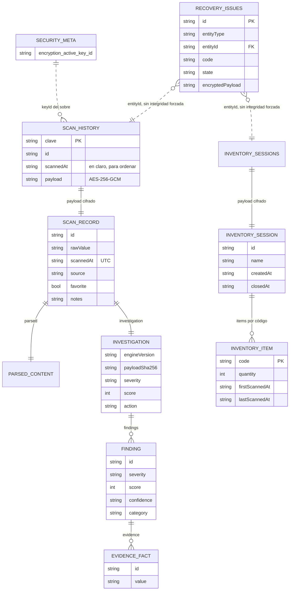

# 07 · Base de datos

## Motor

**No hay motor relacional.** El sistema usa **Sembast**, una base de datos
NoSQL embebida, orientada a documentos, escrita en Dart puro y sin servidor.

| Plataforma | Backend | Archivo o almacén |
|---|---|---|
| Android e iOS | `sembast` sobre archivo | `<directorio de soporte>/rootcause_qr_inspector_v2.db` |
| Web (demo) | `sembast_web` sobre IndexedDB | Base `rootcause_qr_inspector_v2.db` |
| Otras | `database_opener_stub.dart` | Lanza `UnsupportedError` |

La elección se resuelve **en compilación**, no en ejecución:

```dart
export 'database_opener_stub.dart'
    if (dart.library.io) 'database_opener_io.dart'
    if (dart.library.js_interop) 'database_opener_web.dart';
```

El sufijo `_v2` del nombre existe porque esta base coexiste con la generación
anterior heredada del lector universal.

Consecuencias de este diseño, que conviene tener claras al auditar:

- **no hay credenciales de base de datos**, ni cadena de conexión, ni puerto;
- **no hay SQL**: no existe superficie de inyección SQL;
- **no hay esquema declarado**: los almacenes se crean de forma perezosa;
- la integridad referencial no la impone el motor, sino el código.

## Forma de conexión

```dart
final AppDatabase db = await AppDatabase.open();       // persistente
final AppDatabase tmp = await AppDatabase.openTemporary(); // en memoria
```

`open()` crea el directorio si falta, abre el archivo con `version: 2` y ejecuta
`SchemaMigrator.migrate()` **antes** de devolver la instancia, de modo que ningún
repositorio observe un esquema a medio migrar.

`openTemporary()` abre una base en memoria con nombre único por microsegundo
(`rcqr_temporary_<micros>`). Es el modo de arranque seguro: la aplicación
funciona sin poder tocar ni dañar los datos persistentes.

## Configuración necesaria

Ninguna. No hay variables de entorno, archivos de conexión ni migraciones que
lanzar a mano.

## Almacenes

Sembast llama *store* a lo que en una base relacional sería una tabla. Hay
cinco.

### `scan_history`

| Columna | Tipo | Nulo | Descripción |
|---|---|---|---|
| *clave del registro* | String | No | Igual a `id`. SHA-256 truncado a 20 de `carga\|instante` |
| `id` | String | No | Repetido dentro del valor para reconstruir el registro |
| `scannedAt` | String ISO-8601 UTC | No | **En claro a propósito**: permite ordenar y podar sin descifrar |
| `payload` | String | No | Sobre AES-256-GCM con el `ScanRecord` completo |

**Ordenación:** descendente por `scannedAt`.
**Límite:** 5000 registros; el recorte elimina los más antiguos.
**Quién lo usa:** `HistoryRepository`, `RecoveryService`, `DataMaintenanceService`.

### `inventory_sessions`

| Columna | Tipo | Nulo | Descripción |
|---|---|---|---|
| *clave* | String | No | Igual a `id`. SHA-1 truncado a 16 de `micros\|nombre` |
| `id` | String | No | Identificador de la sesión |
| `createdAt` | String ISO-8601 | No | En claro, para ordenar |
| `payload` | String | No | Sobre cifrado con la `InventorySession` completa |

**Ordenación:** descendente por `createdAt`.
**Quién lo usa:** `InventoryRepository`, `RecoveryService`, `DataMaintenanceService`.

### `recovery_issues`

| Columna | Tipo | Nulo | Descripción |
|---|---|---|---|
| *clave* | String | No | SHA-256 truncado a 24 de `tipo\|entidad\|código`. Determinista: el mismo fallo no genera duplicados |
| `id` | String | No | Igual a la clave |
| `entityType` | String | No | `history`, `inventory`, `migration`, `database` o `startup` |
| `entityId` | String | No | Clave del registro afectado |
| `detectedAt` | String ISO-8601 UTC | No | Cuándo se detectó |
| `code` | String | No | Ver códigos de error en [05-technical-reference.md](05-technical-reference.md) |
| `state` | String | No | `unresolved`, `recovered` o `deleted` |
| `encryptedPayload` | String | **Sí** | El sobre original tal cual. Nunca texto claro |

### `_schema_meta`

| Clave | Tipo | Escrita por |
|---|---|---|
| `schemaVersion` | int | Cada migración |
| `v2MigratedAt` | String ISO-8601 | Paso 2 |
| `recoveryStoreEnabled` | bool | Paso 3 |
| `cipherEnvelopeVersion` | int | Paso 3 |
| `encryptionMetadataInDatabase` | bool | Paso 4 |

### `_security_meta`

| Clave | Tipo | Descripción |
|---|---|---|
| `encryption_active_key_id` | String | Identificador de la llave activa. **No es la llave**: la llave vive en Keychain/Keystore |

## Diccionario de datos del contenido cifrado

El `payload` de `scan_history` contiene, ya descifrado, un `ScanRecord`:

| Campo | Tipo | Nulo | Descripción |
|---|---|---|---|
| `id` | String | No | SHA-256 truncado a 20 |
| `rawValue` | String | No | Carga exacta del código |
| `displayValue` | String | No | Valor legible; para binario, «Datos binarios (N bytes)» más la carga |
| `format` | String | No | Simbología legible, p. ej. `QR Code` |
| `contentType` | String | No | Título del contenido interpretado |
| `scannedAt` | String ISO-8601 **UTC** | No | Serializado en UTC para que un respaldo movido entre zonas conserve el id |
| `source` | String | No | `Cámara`, `Imagen`, `PDF · página N`, `Inventario`, `Importado` |
| `riskLevel` | String | No | `low`, `caution` o `high`. Derivado |
| `riskReasons` | List&lt;String&gt; | No | Explicaciones en español. Derivado |
| `canOpen` | bool | No | Derivado |
| `parsed` | Object | No | `ParsedContent` |
| `investigation` | Object | No | `QrInvestigation` completa |
| `favorite` | bool | No | Marca de la persona |
| `tags` | List&lt;String&gt; | No | Etiquetas de la persona |
| `notes` | String | No | Nota libre de la persona |

`parsed`:

| Campo | Tipo | Descripción |
|---|---|---|
| `kind` | String | Uno de los 17 `ContentKind` |
| `title` | String | Título en español |
| `summary` | String? | Resumen corto |
| `fields` | Map&lt;String,String&gt; | Campos legibles |
| `sensitive` | bool | **Decide si el registro puede persistirse** |

`investigation`: ver el JSON Schema en
[`../../schemas/rootcause-qr-evidence.schema.json`](../../schemas/rootcause-qr-evidence.schema.json),
sección `$defs.investigation`.

El `payload` de `inventory_sessions` contiene una `InventorySession`:

| Campo | Tipo | Descripción |
|---|---|---|
| `id` | String | Identificador |
| `name` | String | Nombre dado por la persona |
| `createdAt` | String ISO-8601 | Apertura |
| `closedAt` | String? | Cierre; `null` mientras esté abierta |
| `items` | Map&lt;String, InventoryItem&gt; | **Clave: la carga del código** |

`InventoryItem`: `code`, `format`, `label`, `quantity`, `firstScannedAt`,
`lastScannedAt`, `notes`.

## Relaciones



**Explicación del diagrama.** Las líneas continuas son contención real: un
registro de historial *contiene* un `ScanRecord` cifrado, que a su vez contiene
su interpretación y su investigación. Las líneas punteadas son referencias
**lógicas** que ningún motor valida: una incidencia de recuperación guarda el
`entityId` del registro afectado, pero si ese registro se borra la incidencia
sobrevive. `RecoveryService.discard` es quien mantiene la coherencia, no la base.

La relación con `_security_meta` es igualmente lógica: cada sobre lleva su
propio `keyId`, y el metadato indica cuál es el activo para escribir. Por eso una
rotación debe cambiar ambos en la **misma** transacción.

## Índices

**No hay índices declarados.** Sembast no los expone en esta versión de la API.
Las consultas usan `Finder` con orden y filtro, que recorren el almacén:

| Consulta | Dónde | Coste |
|---|---|---|
| Historial ordenado, límite 5000 | `HistoryRepository.load` | Recorrido completo |
| Registros anteriores a una fecha | `HistoryRepository.pruneOlderThan` | Filtro `Filter.lessThan('scannedAt', corte)` |
| Los más antiguos para recortar | `HistoryRepository._trim` | Orden ascendente con límite |
| Sesiones por fecha | `InventoryRepository.load` | Recorrido completo |
| Incidencias por fecha | `RecoveryRepository.load` | Recorrido completo |

Que `scannedAt` y `createdAt` estén **en claro** es lo que hace posible ordenar y
podar sin descifrar 5000 sobres. Es una decisión de rendimiento con un coste de
privacidad declarado: quien acceda al archivo sabe *cuándo* hubo lecturas,
aunque no *qué* se leyó.

## Restricciones e integridad

| Regla | Quién la impone |
|---|---|
| La clave del historial es el id del registro | `HistoryRepository`, al escribir |
| El id es `SHA-256(carga\|instante)` truncado | `ScanRecord`, en sus fábricas |
| La clave de un producto es su carga | `InventoryStore.addScan` |
| Un id de incidencia no se duplica | Derivación determinista en `RecoveryRepository.record` |
| Solo una sesión activa | `InventoryStore.activeSession`, que exige `isOpen` |
| Un registro sensible no se persiste | `ScannerScreen._persistAndShow` |
| Máximo 5000 registros | `HistoryRepository._trim` |

## Procedimientos almacenados, funciones y disparadores

**No identificados.** Sembast no los soporta. Toda la lógica está en Dart.

## Migraciones

`SchemaMigrator` mantiene el número de esquema en `_schema_meta`. Una
instalación sin ese registro se interpreta como versión 1.

| Paso | Qué escribe | Motivo |
|---|---|---|
| 2 | `v2MigratedAt` | Marca temporal de la primera migración |
| 3 | `recoveryStoreEnabled`, `cipherEnvelopeVersion` | Reserva el almacén de recuperación y fija la versión de sobre |
| 4 | `encryptionMetadataInDatabase` | Declara que la llave activa vive en la base |

Los cuatro pasos ocurren **dentro de una sola transacción** y son idempotentes:
Sembast crea los almacenes de forma perezosa, así que una migración solo escribe
metadatos que otros componentes consultan. `test/core/schema_migrator_test.dart`
comprueba que ejecutarla dos veces no produce cambios adicionales.

Hay una segunda migración, independiente del esquema: la del **historial
heredado guardado en preferencias**. Está explicada paso a paso en
[06-deep-code-explanation.md](06-deep-code-explanation.md) y documentada en
[`../quality/MIGRATIONS.md`](../quality/MIGRATIONS.md).

## Datos iniciales

**No hay semillas.** Una instalación nueva arranca con historial e inventario
vacíos. Los únicos datos precargados están en la interfaz del generador, y son
valores de ejemplo con dominios reservados.

## Transacciones

| Operación | Por qué es transaccional |
|---|---|
| Migración de esquema | O se aplican todos los pasos o ninguno |
| `HistoryRepository.replaceAll` | Borrar e insertar debe ser atómico |
| `HistoryRepository.upsertAll` | Un lote no puede quedar a medias |
| `pruneOlderThan` y `_trim` | Borrado en bloque |
| `_migrateRecordsAtomically` | Escribe **y verifica** dentro de la misma transacción |
| `rotateEncryptionKey` | Registros y llave activa cambian juntos |
| `RecoveryRepository.clearResolved` | Borrado en bloque |

Patrón común y deliberado: **el cifrado se prepara siempre fuera de la
transacción**, y dentro solo quedan las escrituras.

## Datos sensibles almacenados

| Dato | Dónde | Protección |
|---|---|---|
| Carga de los códigos | `payload` de `scan_history` | AES-256-GCM |
| Notas y etiquetas | Dentro del mismo sobre | AES-256-GCM |
| Códigos de producto | `payload` de `inventory_sessions` | AES-256-GCM |
| Instantes de lectura | `scannedAt`, `createdAt` | **En claro** |
| Llave de cifrado | Keychain / Keystore | Almacén seguro del sistema |
| OTP, Wi-Fi con contraseña, pagos, identidad | **No se almacenan** | Filtrados antes de escribir |

## Respaldo y recuperación

**No hay respaldo automático.** No existe exportación programada ni copia en la
nube. Las vías disponibles son manuales y explícitas:

| Vía | Qué produce | Contiene la carga |
|---|---|---|
| Historial → Exportar JSON/CSV/XLSX | Archivo completo | **Sí, en claro**. La interfaz lo advierte |
| Inventario → Exportar | Sesión completa | Sí |
| Recuperación → Copiar paquete | Incidencias con sobres cifrados | No: sin la llave no se leen |
| Resultado → Evidencia | Paquete redactado de un caso | No, salvo decisión explícita por API |

En Android, `tool/bootstrap.py` fija `android:allowBackup="false"` en el
manifiesto, así que la base **no entra en la copia de seguridad automática del
sistema**. Es coherente con el modelo: la llave vive en el Keystore y no viajaría
con la copia, de modo que un respaldo restaurado en otro dispositivo contendría
sobres ilegibles.

**Consecuencia operativa que debe conocerse:** desinstalar la aplicación, o
perder el dispositivo, significa perder el historial. No hay recuperación
posible, por diseño.

## Relación entre almacenes y código

| Almacén | Repositorio | Store | Pantalla |
|---|---|---|---|
| `scan_history` | `HistoryRepository` | `ScanStore` | Escáner, Historial |
| `inventory_sessions` | `InventoryRepository` | `InventoryStore` | Inventario |
| `recovery_issues` | `RecoveryRepository` | — | Recuperación |
| `_schema_meta` | `SchemaMigrator` | — | — |
| `_security_meta` | `EncryptionMetadataRepository` | — | Ajustes (rotación) |
