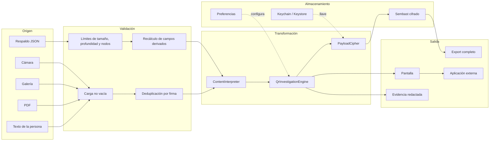
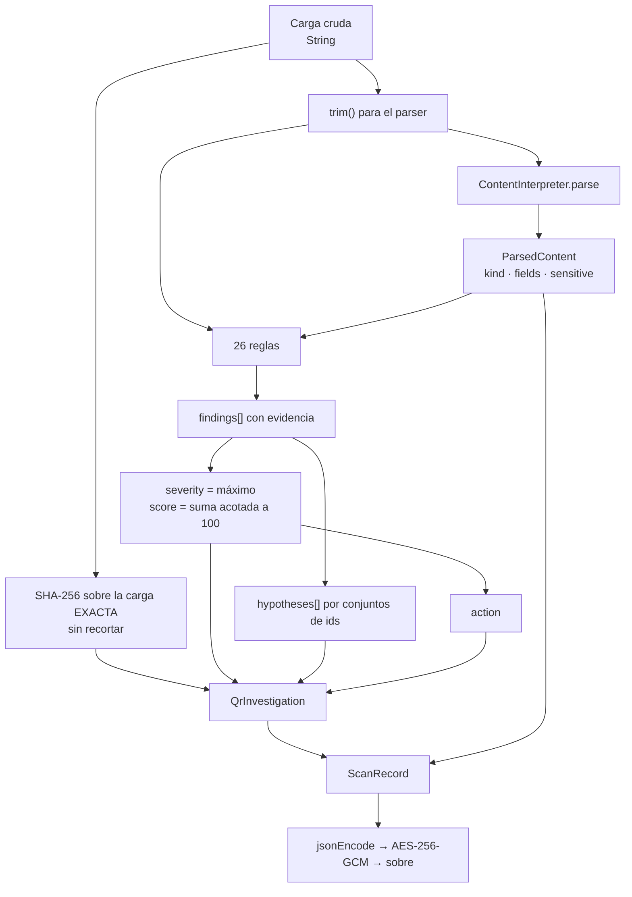
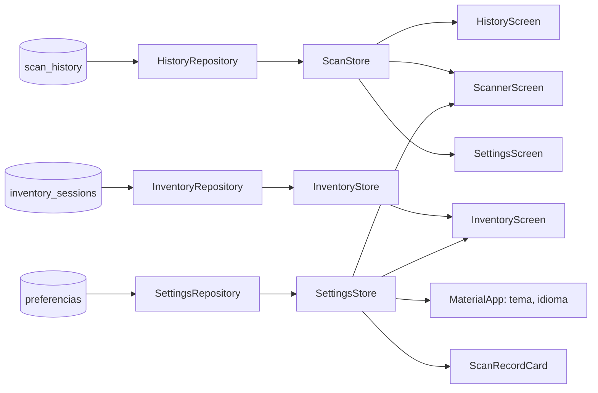

# 08 · Flujo de datos

## Panorama



**Explicación.** Hay dos caminos de entrada con niveles de confianza distintos.
La captura pasa por validaciones ligeras porque el contenido es el objeto de
estudio; un respaldo importado pasa por límites duros y por un recálculo
obligatorio de todo campo derivado. Ambos convergen en el intérprete y el motor.
Desde ahí, el dato se bifurca: a la pantalla siempre; a la base solo si supera la
política de persistencia; a un archivo solo si la persona lo exporta.

## De dónde provienen los datos

| Dato | Origen | Confianza | Control aplicado |
|---|---|---|---|
| Carga de un código | Cámara, imagen, PDF | **Ninguna**: es el objeto de análisis | Nunca se ejecuta; se interpreta y se analiza |
| Bytes de un código binario | `rawDecodedBytes` | Ninguna | Se codifica como `binary-base64:` y se marca opaco |
| Respaldo de historial | Archivo elegido | **Ninguna** | Cinco barreras; ver [06](06-deep-code-explanation.md) |
| Respaldo de inventario | Archivo elegido | Ninguna | Tamaño, forma, sobre y límite de productos |
| Preferencias | Almacén del sistema | Media | Valor por defecto conservador por clave |
| Política de análisis | Código del integrador | Alta | Es configuración, no entrada |
| Llave de cifrado | Keychain / Keystore | Alta | Nunca se recrea al descifrar |
| Notas y etiquetas | Teclado | Alta | Se recortan; se guardan cifradas |

## Cómo se validan

### Captura

1. `ScanRecord.payloadForBarcode` descarta el código sin texto ni bytes.
2. Los códigos del mismo cuadro se reducen a un mapa por carga.
3. La firma ordenada de las cargas alimenta el filtro de repetición de 2,5 s.
4. No hay validación de *contenido*: analizar contenido inválido es la función.

### Importación

Las cinco barreras están detalladas en
[06-deep-code-explanation.md](06-deep-code-explanation.md). La más importante:
todo campo derivado se **recalcula**, así que un archivo no puede imponer un
veredicto favorable.

### Preferencias

Cada lectura aplica un valor por defecto:

```dart
soundEnabled: await _preferences.getBool('sound_enabled') ?? true,
```

Las banderas se decodifican dentro de un `try`; si el JSON está corrupto se
vuelve a `const FeatureFlags()`, todas apagadas.

## Cómo se transforman



**Explicación.** La bifurcación de la izquierda es deliberada: la huella cubre
la carga exacta, mientras que el análisis trabaja sobre una copia recortada. Así,
un código con un carácter invisible al principio produce una huella distinta y
además dispara `url-control-character`, en lugar de pasar por idéntico a otro.

Transformaciones concretas, con su archivo:

| Transformación | Dónde | Nota |
|---|---|---|
| Bytes → `binary-base64:` | `ScanRecord.payloadForBarcode` | Da una carga estable a lo que no es texto |
| `www.x` → `https://www.x` | `_toWebUri` y `ContentInterpreter._webUri` | Solo para analizar; la carga guardada no cambia |
| Ruta con `%xx` → decodificada | `_safeDecode` | Tolerante a codificación inválida |
| Marca o token → comparable | `_comparable` | Minúsculas sin caracteres no alfanuméricos |
| Instante local → UTC | `ScanRecord.toJson` | Conserva id y correlación entre zonas horarias |
| Objeto → sobre cifrado | `PayloadCipher.encryptJson` | Nonce, texto cifrado y MAC en Base64 |
| Objeto → JSON canónico | `QrEvidenceExporter._canonicalJson` | Claves ordenadas, para que el checksum resista reordenamientos |

## Dónde se almacenan

Ver [07-database.md](07-database.md). Resumen del destino de cada dato:

| Dato | Destino | Cifrado |
|---|---|---|
| `ScanRecord` completo | `scan_history.payload` | Sí |
| Instante de lectura | `scan_history.scannedAt` | **No** |
| `InventorySession` | `inventory_sessions.payload` | Sí |
| Sobre de un registro ilegible | `recovery_issues.encryptedPayload` | Ya venía cifrado |
| Preferencias | `SharedPreferencesAsync` | No |
| Llave | Keychain / Keystore | Es el secreto |
| Diagnóstico | **Solo memoria**, máximo 100 entradas | No aplica |
| Páginas de PDF rasterizadas | Directorio temporal | No; se borran al terminar |

## Qué componentes los consumen



**Explicación.** Ninguna pantalla lee la base directamente. El único dato que
atraviesa todas las capas es la configuración: el tema la usa el `MaterialApp`,
la política de ocultación la usa la tarjeta de resultado, y las opciones de
sonido y marco las usan las dos pantallas con cámara.

## Qué información se envía a servicios externos

**Ninguna, de forma automática.** No hay ninguna llamada de red en `lib/`.

Las únicas salidas fuera del proceso las inicia siempre la persona:

| Salida | Qué sale | Confirmación previa |
|---|---|---|
| Abrir una URI | La URI, a la aplicación que el sistema elija | Sí, salvo `allow` con la confirmación general desactivada |
| Compartir evidencia | JSON redactado | La propia acción es la confirmación |
| Compartir historial | JSON, CSV o XLSX **en claro** | **Sí**, diálogo explícito de advertencia |
| Compartir inventario | JSON, CSV o XLSX | La propia acción |
| Compartir contacto o evento | `.vcf` o `.ics` con la carga | Sí, si el contenido es sensible |
| Compartir código generado | PNG o SVG | La propia acción |
| Copiar al portapapeles | La carga | Sí, si es sensible; con borrado programado |
| Copiar diagnóstico | Metadatos técnicos, sin cargas | La propia acción |
| Copiar paquete de recuperación | Sobres cifrados, sin llave | La propia acción |

Detalle de la acción externa: `url_launcher` con `LaunchMode.platformDefault`.
Antes de invocarlo se comprueba `QrActionDecision`: si es `block`, el botón no
existe.

## Qué datos se presentan a la persona

| Elemento | Qué muestra | Ocultación |
|---|---|---|
| Tarjeta de resultado | Campos interpretados | Los campos sensibles se sustituyen por `••••••••` si `hideSensitiveValues` está activo |
| Banner de riesgo | Severidad, puntaje, decisión, número de señales | — |
| Detalle de hallazgos | Título, explicación, acción sugerida, **id técnico** y hechos | — |
| Hipótesis | Etiqueta en español | — |
| Límites | Lista de lo no comprobado | Siempre visible |
| Historial | Resumen, formato, fecha y **carga** | Sin ocultación en la lista |
| Barra de estado | Fase de la cámara y mensaje | Anunciada como región activa |

La ocultación de campos alcanza a `Contraseña`, `Secreto`, `Consulta`,
`Dirección`, `IBAN` y `Carga`, y solo cuando el contenido está marcado como
sensible.

## Dónde pueden producirse errores, pérdidas o inconsistencias

| Punto | Riesgo | Mitigación |
|---|---|---|
| Descifrado de un registro | Llave ausente o carga manipulada | Se aísla como incidencia, **no se borra**; el resto sigue cargando |
| Migración del historial heredado | Pérdida al borrar el origen antes de verificar | Respaldo cifrado previo, verificación dentro de la transacción, borrado al final |
| Rotación de llave | Estado mixto | Reencriptado en memoria y escritura en una sola transacción; la llave nueva se borra si falla |
| Recorte a 5000 | Pérdida de los registros más antiguos | Es el comportamiento declarado; el límite está documentado |
| Retención configurada | Borrado por antigüedad | Ocurre al arrancar y al cambiar la opción; el valor por defecto es «sin límite» |
| Modo temporal | Todo se pierde al cerrar | Banner permanente en la interfaz |
| Desinstalación | Pérdida total: la llave vive en el Keystore | `allowBackup="false"`. Sin recuperación posible, por diseño |
| Importación con `replace` | Sustituye la base completa | Vista previa antes de elegir la estrategia; la escritura es transaccional |
| Lote cancelado | Ninguna: el historial no se toca | Mensaje explícito |
| Portapapeles | El valor sobrevive si la app muere antes del temporizador | Límite declarado |
| Reloj del dispositivo | Un instante erróneo cambia el id | El id es `SHA-256(carga\|instante)`; no hay corrección de reloj |

## Datos personales y sensibles que se procesan

| Categoría | De dónde | Qué se hace |
|---|---|---|
| Contraseñas Wi-Fi | QR `WIFI:` | Se muestran ocultas; **no se persisten** |
| Secretos OTP | QR `otpauth:` | Se muestran ocultos; **no se persisten** |
| Datos de pago | EMVCo, EPC, Swiss QR, cripto | Se muestran; **no se persisten** |
| Documentos de identidad | AAMVA | Se muestran; **no se persisten** |
| Contactos | vCard, MeCard | Se muestran y **sí se persisten**: no están marcados como sensibles |
| URL con token, secreto o firma | Consulta, fragmento o `userinfo` | Se marcan sensibles y no se persisten |
| Notas y etiquetas | La persona | Se persisten cifradas |

> **Hallazgo declarado.** Los contactos (vCard/MeCard) contienen nombre,
> teléfono, correo y dirección, y **no** están marcados como `sensitive`, así
> que entran en el historial automático. Es coherente con la política escrita
> —que enumera OTP, Wi-Fi, pago e identidad— pero merece revisión explícita.
> Registrado en [15-risks-and-technical-debt.md](15-risks-and-technical-debt.md).

## Ejemplo de flujo completo

Carga observada: `https://banco.example@evil.example/acceso`. Ningún dato real.

```text
1. Captura
   rawValue = "https://banco.example@evil.example/acceso"

2. Huella
   payloadSha256 = SHA-256 de esa cadena exacta

3. Interpretación
   kind      = url
   summary   = "evil.example"
   fields    = {Dominio: evil.example, Protocolo: HTTPS, Ruta: /acceso, ...}
   sensitive = false      (no hay clave de secreto en la consulta)

4. Reglas
   authority-userinfo    critical · 25 · alta   · evidencia host=evil.example
   credential-lure-path  warning  ·  8 · media  · evidencia host=evil.example

5. Agregación
   severity = critical        score = 33/100        action = confirm

6. Hipótesis
   qr-phishing-suspected
   credential-theft-suspected

7. Persistencia
   no es sensible y el historial está activo → se cifra y se guarda

8. Presentación
   banner rojo, 33/100, "Decisión: confirmación obligatoria"
   señales con su id técnico y sus hechos
   límites: reputación remota · DNS efectivo · certificado servido · ...

9. Acción
   el botón «Abrir con confirmación» existe, pero exige un diálogo
   que advierte de las señales críticas

10. Evidencia (si se exporta)
   observation.redaction = "payload-omitted"
   sin rawPayload, sin parsed, sin effectiveUri
   integrity.bundleHash = SHA-256 del JSON canónico
   integrity.assurance  = "checksum-only-not-authenticated"
```

El paquete de evidencia de este caso **no contiene** la URL. Contiene su huella,
los dos ids de hallazgo, sus hechos mínimos, las hipótesis y los límites. Basta
para pedir ayuda o correlacionar, y no reenvía el destino.
