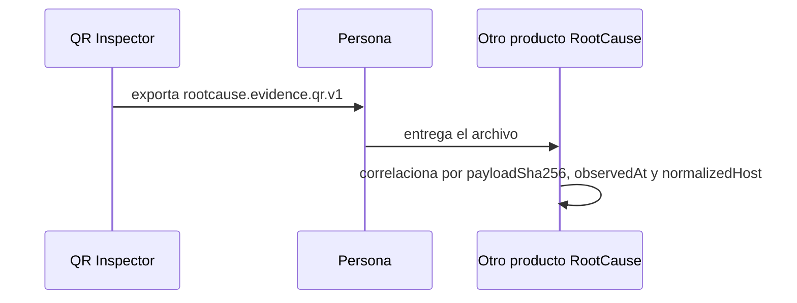

# 09 · APIs e integraciones

## Resumen: no hay API de red

**Comprobado.** El sistema **no expone ni consume ningún endpoint HTTP**. No hay
cliente HTTP, ni WebSocket, ni gRPC, ni SDK de terceros que llame a un servidor.
El paquete `http` de Dart no figura en `pubspec.yaml`.

Verificación reproducible:

```bash
grep -rn "http\.get\|http\.post\|HttpClient\|WebSocket\|dio\|Dio(" lib/
```

No devuelve resultados en el código de la aplicación.

Consecuencias para una auditoría:

- no hay autenticación de API, ni tokens, ni claves de servicio;
- no hay CORS ni CSRF que configurar: no existe superficie web propia;
- no hay límites de tasa, reintentos ni webhooks;
- **no hay dependencia de disponibilidad de terceros**: la aplicación funciona
  entera en modo avión.

Lo que sí existe son **contratos de datos** —formatos que otros sistemas pueden
leer— e **interfaces de plataforma** —servicios del sistema operativo—. Este
documento cataloga ambos.

---

## Contratos de datos publicados

### 1. `rootcause.evidence.qr.v1` — evidencia exportable

Es el contrato principal del producto hacia el exterior.

| Aspecto | Valor |
|---|---|
| Esquema formal | [`../../schemas/rootcause-qr-evidence.schema.json`](../../schemas/rootcause-qr-evidence.schema.json) |
| Dialecto | JSON Schema Draft 2020-12 |
| Productor | `QrEvidenceExporter.toMap` |
| Verificador | `QrEvidenceExporter.verify` |
| Transporte | Archivo compartido por la persona; nunca por red |
| Nombre del archivo | `rootcause-qr-evidence-<id del registro>.json` |

Estructura:

| Campo | Tipo | Obligatorio | Descripción |
|---|---|---|---|
| `schema` | const | Sí | `rootcause.evidence.qr.v1` |
| `product.name` | const | Sí | `RootCause QR Inspector` |
| `product.version` | string | Sí | Patrón `^\d+\.\d+\.\d+$` |
| `bundleId` | string | Sí | 24 caracteres hex; SHA-256 de `id\|huella\|instante` |
| `observedAt` | date-time | Sí | Instante de la observación, en UTC |
| `observation.source` | string | Sí | `Cámara`, `Imagen`, `PDF · página N`… |
| `observation.symbology` | string | Sí | Simbología legible |
| `observation.contentKind` | string | Sí | Uno de los 17 `ContentKind` |
| `observation.sensitive` | bool | Sí | Si el contenido se clasificó como sensible |
| `observation.payloadBytes` | int ≥ 0 | Sí | Tamaño de la carga en bytes |
| `observation.payloadSha256` | sha256 | Sí | Huella de la carga exacta |
| `observation.redaction` | enum | Sí | `payload-omitted` o `none-user-authorized` |
| `observation.rawPayload` | string | **Prohibido** si `payload-omitted` | La carga completa |
| `observation.parsed` | object | **Prohibido** si `payload-omitted` | Campos interpretados |
| `investigation` | object | Sí | La investigación completa |
| `integrity.algorithm` | const | Sí | `SHA-256` |
| `integrity.assurance` | const | Sí | `checksum-only-not-authenticated` |
| `integrity.bundleHash` | sha256 | Sí | Checksum del paquete |
| `integrity.previousEvidenceHash` | sha256 | No | Enlace manual a un paquete anterior |

`additionalProperties: false` en todos los niveles: un campo no previsto invalida
el paquete.

Ejemplo **redactado** (valores ficticios):

```json
{
  "schema": "rootcause.evidence.qr.v1",
  "product": { "name": "RootCause QR Inspector", "version": "0.1.1" },
  "bundleId": "0f3a91c47b25de806a1c4f7b",
  "observedAt": "2026-08-26T14:02:11.000Z",
  "observation": {
    "source": "Cámara",
    "symbology": "QR Code",
    "contentKind": "url",
    "sensitive": false,
    "payloadBytes": 41,
    "payloadSha256": "3b1f...c9",
    "redaction": "payload-omitted"
  },
  "investigation": {
    "schema": "rootcause.qr-investigation.v1",
    "engineVersion": "0.1.0",
    "analyzedAt": "2026-08-26T14:02:11.000Z",
    "payloadSha256": "3b1f...c9",
    "verdict": { "severity": "critical", "score": 33, "action": "confirm" },
    "normalizedHost": "evil.example",
    "findings": [
      {
        "id": "authority-userinfo",
        "severity": "critical",
        "score": 25,
        "confidence": "high",
        "category": "obfuscation",
        "evidence": [{ "id": "host", "value": "evil.example" }]
      }
    ],
    "hypotheses": ["qr-phishing-suspected"],
    "evaluatedRuleIds": ["url-control-character", "sensitive-secret", "..."],
    "limitations": ["no-remote-reputation", "no-dns-resolution", "..."]
  },
  "integrity": {
    "algorithm": "SHA-256",
    "assurance": "checksum-only-not-authenticated",
    "bundleHash": "a7c0...41"
  }
}
```

Observe que **no hay ninguna URL**. Hay una huella, un host normalizado, ids de
hallazgo y sus hechos mínimos.

**Cómo verificar un paquete** sin la aplicación:

1. quitar `integrity.bundleHash` del objeto;
2. serializar el resultado con las claves de cada objeto ordenadas
   alfabéticamente y sin espacios;
3. calcular SHA-256 sobre esos bytes UTF-8;
4. comparar con el valor retirado.

Coincidir prueba **consistencia interna**, no autoría: quien modifique el
archivo puede recalcularlo. El campo `assurance` lo dice explícitamente.

### 2. `rootcause.qr-investigation.v1` — investigación

Va embebida dentro de la evidencia y también dentro de cada `ScanRecord`
persistido. Definida en `$defs.investigation` del mismo esquema.

### 3. `rootcause.qr-policy.v1` — política de análisis

| Aspecto | Valor |
|---|---|
| Ejemplo | [`../../config/rootcause-qr-policy.example.json`](../../config/rootcause-qr-policy.example.json) |
| Consumidor | `QrAnalysisPolicy.fromJson` |
| **Estado** | **La interfaz no carga este archivo.** Es un contrato para integradores |

```json
{
  "schema": "rootcause.qr-policy.v1",
  "maxUrlLength": 240,
  "maxDomainLabels": 5,
  "allowPrivateTargets": false,
  "trustedBrands": [
    {
      "id": "banco-ejemplo",
      "tokens": ["banco-ejemplo", "bancoejemplo"],
      "allowedHosts": ["banco-ejemplo.example"]
    }
  ]
}
```

`tool/verify_rootcause_contract.py` exige que el ejemplo use **solo** dominios
`.example` y que cada token tenga al menos cuatro caracteres alfanuméricos.

### 4. Respaldo de historial e inventario

| Campo | Valor |
|---|---|
| `application` | `RootCause QR Inspector` o `Universal Code Scanner` |
| `schemaVersion` | `2` actual; `1` es la lista heredada sin sobre |
| `type` | `history` o `inventory` |
| `exportedAt` | ISO-8601 UTC |
| `records` / `session` | Contenido |

**Contiene las cargas en claro.** No es un formato de evidencia.

### 5. Paquete de recuperación

`type: recovery`, con las incidencias y sus sobres **todavía cifrados**. Incluye
un campo `notice` que declara que no lleva llave.

### 6. `rootcause.qr-fixtures.v1`

Casos sintéticos de regresión en
[`../../fixtures/qr/manifest.json`](../../fixtures/qr/manifest.json). Los valida
`verify_rootcause_contract.py`: mínimo 12 casos, ids únicos, acciones y
severidades válidas, reglas existentes y **hosts reservados** —con `bit.ly` como
única excepción, necesaria para probar la regla de acortadores—.

---

## Interfaces de plataforma consumidas

No son APIs de red: son servicios del sistema operativo a través de plugins.

| Interfaz | Paquete | Qué pide | Permiso | Si falla |
|---|---|---|---|---|
| Cámara | `mobile_scanner` 7.4.0 | Cuadros para decodificar | `CAMERA` | Estado `unavailable` con acción de reintento |
| Galería | `image_picker` 1.2.3 | Hasta 20 imágenes | Selector del sistema | Lote vacío, mensaje |
| Archivos | `file_picker` 12.0.0 | JSON o PDF | Selector del sistema | Se cancela sin efecto |
| Render de PDF | `pdfrx` 2.4.5 | Páginas a imagen | — | `UnsupportedError` en web |
| Almacén seguro | `flutter_secure_storage` 11.0.0 | Guardar la llave | Keychain / Keystore | Arranque seguro y modo temporal |
| Autenticación local | `local_auth` 3.0.2 | Huella, rostro o PIN | `USE_BIOMETRIC` | Devuelve `false`; la app sigue bloqueada |
| Audio | `audioplayers` 6.8.1 | Reproducir el tono | — | Degrada al sonido del sistema |
| Vibración | `flutter/services` | `heavyImpact` | — | Se ignora |
| Portapapeles | `flutter/services` | Copiar y limpiar | — | Se ignora |
| Compartir | `share_plus` 13.3.0 | Entregar un archivo | — | Excepción capturada por la pantalla |
| Abrir URI | `url_launcher` 6.3.2 | Delegar la URI | — | Mensaje: no hay aplicación compatible |
| Directorios | `path_provider` 2.1.6 | Soporte y temporal | — | Arranque seguro |
| Preferencias | `shared_preferences` 2.5.5 | Configuración | — | Valores por defecto |

### Permisos declarados

`tool/bootstrap.py` los inserta en el manifiesto de Android:

```xml
<uses-permission android:name="android.permission.CAMERA" />
<uses-permission android:name="android.permission.USE_BIOMETRIC" />
<uses-feature android:name="android.hardware.camera.any" android:required="false" />
```

Y añade `android:allowBackup="false"` a la etiqueta `<application>`.

En iOS inserta tres descripciones de uso en `Info.plist`:
`NSCameraUsageDescription`, `NSPhotoLibraryUsageDescription` y
`NSFaceIDUsageDescription`, además de un archivo de *entitlements* con
`keychain-access-groups` vacío.

**No se pide** permiso de red, ubicación, contactos, micrófono ni
almacenamiento externo.

---

## Integración con la familia RootCause

En esta versión la integración es **manual y explícita**. No hay sincronización
automática, ni servidor, ni bus entre aplicaciones.



**Explicación.** La persona es el transporte. Es una decisión de privacidad: sin
un canal automático no hay forma de que un evento salga del dispositivo sin una
acción deliberada.

Campos pensados para correlacionar, sin revelar la carga:

| Campo | Uso |
|---|---|
| `observation.payloadSha256` | Identificar el mismo código en dos superficies |
| `observedAt` | Ventana temporal |
| `investigation.normalizedHost` | Coincidencia por destino |
| `investigation.findings[].id` | Coincidencia por tipo de señal |
| `integrity.bundleHash` | Detectar que el paquete cambió |

Mapeo propuesto a un esquema común futuro:
[`../rootcause/INTEGRATION.md`](../rootcause/INTEGRATION.md).

---

## Puntos de extensión para integradores

| Punto | Interfaz | Cómo |
|---|---|---|
| Política de análisis | `QrAnalysisPolicy` | Pasarla a `QrInvestigationEngine.analyze` o a `ScanSecurityAnalyzer.analyze` |
| Nuevo formato de contenido | `ContentParser` | `ContentParserRegistry.instance.register(parser)` con prioridad > -1000 |
| Nuevo motor de captura | `ScannerEngine` | Implementar los nueve miembros |
| Evidencia con carga completa | `includeRawPayload: true` | **Solo por API**: la interfaz no ofrece ese botón |
| Cadena de evidencias | `previousEvidenceHash` | Debe ser SHA-256 hexadecimal en minúsculas |

Ejemplo de parser adicional:

```dart
class MiParser implements ContentParser {
  @override String get id => 'mi-formato';
  @override int get priority => 100;          // mayor que el integrado (-1000)
  @override bool canParse(String raw) => raw.startsWith('MIFORMATO:');
  @override ParsedContent parse(String raw) => ParsedContent(
        kind: ContentKind.text,
        title: 'Mi formato',
        fields: <String, String>{'Contenido': raw.substring(11)},
      );
}

ContentParserRegistry.instance.register(const MiParser());
```

El parser integrado `builtin-v2` está protegido: `unregister` no puede
eliminarlo, así que nunca queda la aplicación sin intérprete.

---

## Webhooks, reintentos y límites de tasa

**No aplican.** No hay comunicación de red. Los únicos límites del sistema son
locales y están en [05-technical-reference.md](05-technical-reference.md).

## Dependencias de proveedores externos

En **ejecución**, ninguna: la aplicación no depende de que ningún servicio esté
disponible.

En **construcción y publicación** sí hay dependencias operativas:

| Proveedor | Para qué | Riesgo si falla |
|---|---|---|
| pub.dev | Resolver dependencias | No se compila; el lockfile fija versiones pero no las almacena |
| GitHub Actions | Analizar, probar, compilar y publicar | No hay artefacto nuevo |
| GitHub Releases | Distribuir el APK | No hay canal de descarga alternativo |
| GitHub Pages | Landing y demo | Solo afecta a la documentación pública |
| Google ML Kit / Apple Vision | Decodificar códigos | Vienen embebidos en el plugin; no son un servicio remoto |
