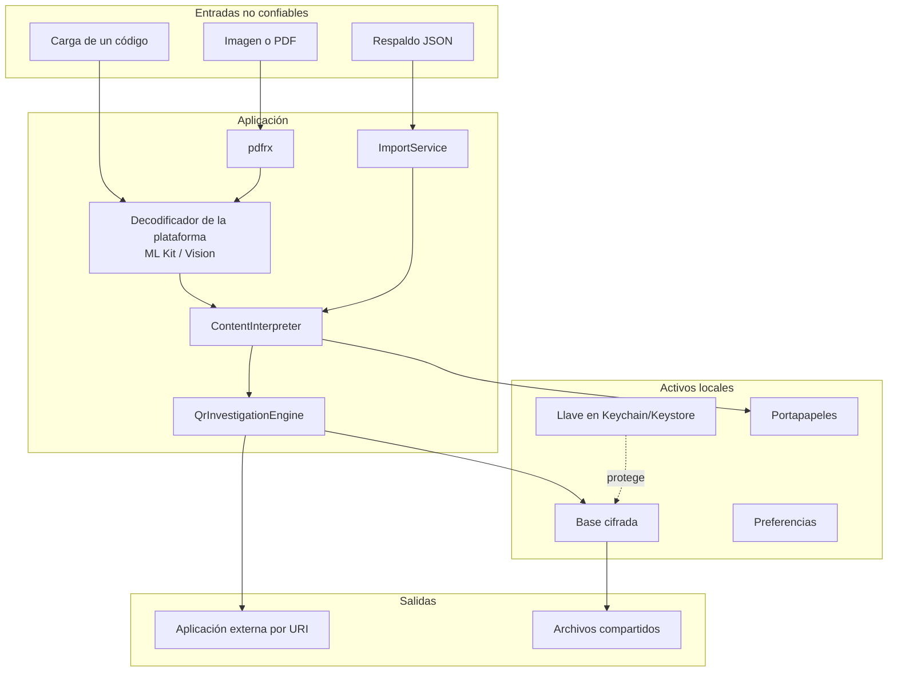

# 11 · Seguridad

Este documento describe los controles **presentes en el código** y, con la misma
claridad, los que **no existen o no se han comprobado**. No es una
certificación ni sustituye una auditoría independiente.

## Modelo de seguridad en una frase

El activo a proteger no es un servidor: son los datos que la persona escanea y
la decisión que toma después. El sistema los protege manteniéndolo todo local,
cifrando lo que persiste y **negándose a ejecutar** la carga que analiza.

## Autenticación

| Aspecto | Estado |
|---|---|
| Autenticación de usuario | **No existe.** No hay cuentas ni sesión |
| Autenticación de servidor | No aplica: no hay servidor |
| Bloqueo local | Opcional, con el autenticador del dispositivo |

`BiometricLockGate` (`lib/app.dart`) implementa el bloqueo:

- se activa desde Ajustes, y **solo si la autenticación tiene éxito en ese
  momento**: no se puede activar a ciegas;
- vuelve a bloquear cuando la aplicación pasa a `inactive`, `paused`, `hidden` o
  `detached`, no solo al cerrarse. Eso cubre el conmutador de aplicaciones y la
  vista previa del sistema;
- si la autenticación falla, la única acción disponible es reintentar. **No hay
  salida alternativa ni código de respaldo propio**;
- `BiometricService` traduce cualquier excepción a `false`, de modo que un
  dispositivo sin enrolamiento deja la aplicación bloqueada en vez de abrirla.

**Requiere validación:** el comportamiento con biometría cancelada, bloqueada
por intentos fallidos o sin enrolar solo puede comprobarse en hardware.

## Autorización

No hay roles ni permisos de usuario. La autorización que sí existe es **sobre
acciones**, no sobre personas: `QrActionDecision` decide si una carga puede
entregarse a otra aplicación.

| Decisión | Botón de acción | Confirmación |
|---|---|---|
| `allow` | Sí | Solo si `confirm_before_open` está activo o el riesgo no es bajo |
| `confirm` | Sí | **Siempre**, aunque la confirmación general esté desactivada |
| `inspectOnly` | No hay acción externa | — |
| `block` | **No aparece** | — |

`verify_rootcause_contract.py` comprueba que la interfaz sigue respetando
`record.investigation.action == QrActionDecision.confirm`. Es un control de
regresión sobre una propiedad de seguridad.

## Gestión de sesiones

No hay sesiones. El estado en memoria muere con el proceso. El «modo temporal»
es lo más parecido: base en memoria y llave volátil, con un banner permanente
que avisa de que nada sobrevivirá al cierre.

## Validación y saneamiento de la entrada

| Entrada | Control |
|---|---|
| Carga de un código | **No se sanea: se analiza.** Nunca se ejecuta ni se abre automáticamente |
| Carga binaria | Se codifica como `binary-base64:` y se clasifica como opaca |
| Respaldo JSON | Cinco barreras; ver [06](06-deep-code-explanation.md) |
| Profundidad del JSON | Recorrido **iterativo** con pila explícita: un documento anidado no puede desbordar la pila |
| Nodos del JSON | Máximo 100 000 |
| Tamaño | 25 MB, comprobado dos veces |
| Campos derivados de un respaldo | **Se recalculan siempre** |
| Notas y etiquetas | Se recortan; las etiquetas se deduplican |
| Preferencias | Valor por defecto conservador por clave |

El control más importante es el último de la lista de respaldos:

```dart
ScanRecord.fromJson(map, trustDerivedAnalysis: false)
```

Sin él, un archivo manipulado podría declarar `severity: normal` y `action:
allow` para una URL de phishing, y la interfaz lo mostraría como seguro.

### Ausencia de superficies clásicas

| Vector | Estado |
|---|---|
| Inyección SQL | **No aplica:** no hay SQL |
| Inyección de comandos | No aplica: no se ejecutan procesos |
| XSS | No aplica: no hay WebView ni HTML propio |
| Deserialización insegura | Solo `jsonDecode` a tipos primitivos, con validación posterior |
| Path traversal | No se construyen rutas con datos del usuario. Las temporales llevan nombre generado |
| CORS / CSRF | No aplica: no hay servidor propio |
| Carga de archivos a un servidor | No existe |

La demo web publicada en GitHub Pages sí es una superficie HTTP, pero sirve
contenido estático y no expone ninguna API.

## Cifrado

| Aspecto | Valor |
|---|---|
| Algoritmo | AES-256-GCM (autenticado) |
| Librería | `cryptography` 2.9.0 |
| Alcance | Toda la carga de historial e inventario |
| Nonce | Generado por la librería en cada operación |
| MAC | Almacenado en el sobre; su fallo rechaza el descifrado |
| Llave | 256 bits, generada en el dispositivo |
| Almacén de la llave | Keychain (iOS) / Keystore (Android) con prefijo `rcqr_database_key_` |
| Metadatos del sobre | Versión, algoritmo, identificador de llave e instante |
| Rotación | Manual desde Ajustes, transaccional |

Propiedades que el diseño garantiza y las pruebas fijan:

1. **Una llave ausente no se recrea.** El descifrado usa `read`, que devuelve
   `null`, no `readOrCreate`. Si se recreara, todos los registros anteriores
   quedarían ilegibles en silencio.
2. **Una llave ausente bloquea nuevas escrituras** con ese identificador hasta
   que la persona recupere, rote o descarte de forma explícita.
3. **Una carga manipulada se rechaza** por el MAC de GCM.
4. **Una versión de sobre desconocida se rechaza** en vez de interpretarse.
5. **Una rotación fallida no deja llave huérfana**: se borra en el `catch`.

**No cifrado, y declarado:** `scannedAt` y `createdAt` viven en claro para poder
ordenar y podar sin descifrar 5000 sobres. Quien acceda al archivo sabe *cuándo*
hubo lecturas, aunque no *qué* se leyó.

## Manejo de secretos

| Secreto | Dónde vive | Sale de ahí |
|---|---|---|
| Llave de cifrado | Keychain / Keystore | **Nunca** |
| Contraseñas Wi-Fi de un QR | Memoria durante el resultado | Solo si la persona copia o comparte, con confirmación |
| Secretos OTP | Igual | Igual |
| Datos de pago | Igual | Igual |

Ninguno de los cuatro se escribe en la base, en un export de evidencia, en el
diagnóstico ni en el paquete de recuperación.

## Registro y auditoría

| Aspecto | Estado |
|---|---|
| Registro de aplicación | **No existe.** El lint `avoid_print` está activo |
| Diagnóstico | Máximo 100 entradas **en memoria**: instante, área, tipo de error y huella de pila |
| Mensaje de la excepción | **No se guarda**, a propósito |
| Auditoría de acciones | No existe: no se registra qué abrió la persona |
| Telemetría | **Cero** |

`check_sensitive_logging` en `validate_structure.py` falla si aparece una
llamada a `print`, `debugPrint` o `log` cuyo argumento mencione `rawValue`,
`password`, `secret`, `otp` o `payload`.

La ausencia de auditoría es coherente con el modelo de privacidad, pero también
significa que **no hay forma de reconstruir qué se escaneó** si el historial se
borra. Es un compromiso explícito.

## Dependencias potencialmente vulnerables

**No se ejecutó ningún escáner de vulnerabilidades en este análisis.**

Lo que sí existe en el repositorio:

| Control | Estado |
|---|---|
| Versiones exactas en `pubspec.yaml` | Sí: todas fijadas, sin rangos |
| `pubspec.lock` versionado | Sí, y la CI comprueba que exista |
| SBOM CycloneDX | `tool/generate_sbom.py`, publicado como artefacto |
| Inventario de licencias | `tool/generate_license_inventory.py` |
| Dependabot | Semanal para `pub`, mensual para Actions |
| Acciones fijadas a SHA | Sí, y `validate_structure.py` falla si alguna no lo está |

**Riesgo declarado:** `pdfrx` está bloqueado por debajo de 2.4.6 y `excel` en
4.0.6 por un conflicto real de `archive`. Un aviso de seguridad en cualquiera de
los dos exigiría resolver antes ese conflicto. Ver
[`../quality/LOCKFILE.md`](../quality/LOCKFILE.md).

## Exposición de información

| Canal | Qué expone | Control |
|---|---|---|
| Pantalla | Campos interpretados | Ocultación de valores sensibles |
| Historial | Carga completa | Cifrado en reposo; sensibles excluidos |
| Export de historial | **Carga en claro** | Diálogo de advertencia obligatorio |
| Export de evidencia | Solo huella y hechos | Redacción por defecto |
| Portapapeles | Carga completa | Confirmación si es sensible; borrado programado |
| Compartir | Lo que se comparte | Confirmación si es sensible |
| Diagnóstico | Metadatos técnicos | Sin mensajes ni cargas |
| Recuperación | Sobres cifrados | Sin llave |
| Vista previa del sistema | Contenido en pantalla | Solo mitigado si el bloqueo está activo |

> **Hallazgo.** La lista del historial muestra la carga completa en el subtítulo
> de cada elemento, sin ocultación, aunque el registro provenga de contenido con
> parámetros largos. La ocultación solo se aplica en la tarjeta de detalle.
> Registrado en [15-risks-and-technical-debt.md](15-risks-and-technical-debt.md).

> **Hallazgo.** No se llama a `FLAG_SECURE` ni al equivalente de iOS, así que el
> sistema puede capturar la pantalla en el conmutador de aplicaciones. El
> bloqueo biométrico mitiga el caso, pero solo si está activado.

## Protección de datos personales

| Principio | Cómo se cumple |
|---|---|
| Minimización | Solo se guarda lo escaneado, y no todo |
| Limitación de finalidad | No hay finalidad secundaria: no hay analítica |
| Limitación del plazo | Retención configurable; límite de 5000 registros |
| Integridad y confidencialidad | AES-256-GCM y llave en almacén del sistema |
| Transparencia | La interfaz declara qué se guarda y qué no |
| Portabilidad | Export JSON, CSV y XLSX |
| Supresión | Borrado por registro, por historial completo o por modo temporal |

Categorías especiales que el sistema puede llegar a tocar: datos de
identificación (AAMVA), datos financieros (pagos) y credenciales. Ninguna se
persiste.

> **Hallazgo.** Los contactos de una vCard —nombre, teléfono, correo,
> dirección— **no** están marcados como sensibles y sí entran en el historial.

## Superficie de ataque



**Explicación.** Tres entradas no confiables cruzan la frontera. Dos de ellas
—código e imagen— pasan primero por código nativo de terceros: el decodificador
de la plataforma y el renderizador de PDF. Ese es el punto donde el sistema
tiene **menos** control: una vulnerabilidad en ML Kit, Vision o `pdfrx` sería
explotable con un archivo diseñado. Los límites de páginas, tamaño y escala
reducen la exposición, pero no la eliminan.

| Vector | Mitigación | Riesgo residual |
|---|---|---|
| Carga diseñada para el decodificador | Límites de lote; sin `returnImage` | Depende del código nativo del proveedor |
| PDF malicioso | 50 páginas, escala acotada, limpieza, cancelación | Superficie de `pdfrx` |
| Respaldo malicioso | Cinco barreras y recálculo obligatorio | Consumo de CPU dentro de los límites |
| URI diseñada para otra aplicación | `block` para esquema, host o autoridad ambiguos; controles invisibles | La aplicación destino puede interpretar distinto |
| Acceso físico al dispositivo | Bloqueo opcional; datos cifrados | Sin bloqueo, el historial está a la vista |
| Copia de seguridad del sistema | `allowBackup="false"` | — |
| Manipulación del archivo de base | AES-GCM aísla el registro dañado | Se pierde ese registro |
| Suplantación de una evidencia | `bundleHash` | **No hay firma**: el checksum se puede recalcular |

## Controles implementados

1. Análisis local sin red ni telemetría.
2. Ninguna carga se ejecuta automáticamente.
3. Bloqueo de URI ambiguas, con cuatro condiciones distintas.
4. Confirmación obligatoria cuando el motor lo decide.
5. Cifrado autenticado de todo lo persistido.
6. Llave en el almacén seguro del sistema, que nunca se recrea al descifrar.
7. Exclusión de OTP, Wi-Fi, pagos e identidad del historial automático.
8. Detección de URL con token, secreto o firma en consulta, fragmento o
   `userinfo`.
9. Evidencia redactada por defecto, con `effectiveUri` eliminado.
10. Entrada no confiable con cinco barreras y recálculo obligatorio.
11. Migraciones transaccionales con verificación previa al borrado.
12. Aislamiento —no borrado— de registros ilegibles.
13. Rotación de llave transaccional con limpieza de material huérfano.
14. Portapapeles con borrado programado y confirmación previa.
15. Diagnóstico sin mensajes ni cargas.
16. `allowBackup="false"` en Android.
17. Permisos mínimos: cámara y biometría.
18. Dependencias fijadas, lockfile, SBOM, licencias y acciones a SHA.
19. Verificadores offline que fallan ante una regresión de contrato.
20. Análisis estático estricto con `--fatal-infos` en CI.

## Controles ausentes o no comprobados

| Control | Estado | Consecuencia |
|---|---|---|
| Firma digital de la evidencia | **Ausente** | El checksum no prueba autoría; el campo `assurance` lo declara |
| Cadena automática de evidencias | Ausente | `previousEvidenceHash` debe enlazarse a mano |
| `FLAG_SECURE` / protección de capturas | **Ausente** | La vista previa del sistema puede mostrar contenido |
| Detección de root o jailbreak | Ausente | Un dispositivo comprometido puede leer la memoria |
| Ofuscación del binario | Ausente | El APK es analizable |
| Certificate pinning | No aplica | No hay red |
| Firma comercial del APK | **Ausente** | Se firma con la clave de depuración de Flutter; `apksigner` valida el esquema v2, no la identidad |
| Escaneo de vulnerabilidades de dependencias | No ejecutado aquí | Requiere una herramienta externa |
| Pruebas de penetración | No realizadas | — |
| Auditoría independiente | **No realizada** | — |
| Validación en dispositivo físico | **Pendiente** | Cámara, biometría, almacén y ciclo de vida |
| Conformidad UTS #39 | Parcial | Se detecta presencia y mezcla de tres alfabetos; no hay skeleton ni perfiles |
| Public Suffix List | Ausente | La familia de host se aproxima por sufijo |

## Pruebas de seguridad existentes

| Prueba | Qué demuestra |
|---|---|
| `payload_cipher_test.dart` | Ida y vuelta, sobre heredado, llave ausente, manipulación rechazada, versión futura rechazada |
| `data_maintenance_test.dart` | Rotación transaccional, aborto antes de tocar metadatos, limpieza de llave huérfana |
| `recovery_service_test.dart` | El paquete conserva el texto cifrado y no incluye la llave |
| `diagnostics_test.dart` | El diagnóstico no incluye mensajes ni valores sensibles |
| `import_service_test.dart` | Límites y, sobre todo, que un respaldo no puede inyectar un veredicto |
| `scan_record_test.dart` | OTP, Wi-Fi con contraseña y URL con secreto se clasifican como sensibles |
| `qr_evidence_exporter_test.dart` | Redacción, detección de alteración y canonicalización |
| `qr_investigation_engine_test.dart` | Punycode, `userinfo`, esquema ejecutable, control codificado, redirección anidada, APK, red privada |

Plan completo, con lo que falta: [`../security/SECURITY_TEST_PLAN.md`](../security/SECURITY_TEST_PLAN.md).
Modelo de amenazas: [`../security/THREAT_MODEL.md`](../security/THREAT_MODEL.md).
Matriz MASVS: [`../security/MASVS_CHECKLIST.md`](../security/MASVS_CHECKLIST.md).

## Cómo reportar una vulnerabilidad

Mediante GitHub Security Advisories, según [`../../SECURITY.md`](../../SECURITY.md).
**Sin adjuntar** QR reales, OTP, contraseñas, semillas, documentos de identidad
ni datos de pago.
