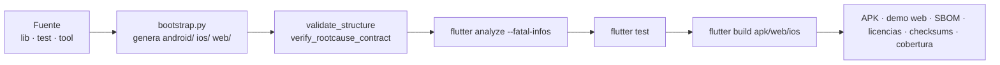

# 13 · Despliegue y operación

## Entornos

**No hay entornos de servidor.** No existe despliegue de backend, base de datos
gestionada ni infraestructura que operar. Lo que se despliega son artefactos.

| «Entorno» | Qué es | Dónde vive |
|---|---|---|
| Desarrollo | Máquina con Flutter y un dispositivo o emulador | Local |
| Integración | Runners de GitHub Actions | Efímeros |
| Distribución | GitHub Releases | Un APK y su checksum |
| Documentación pública | GitHub Pages | Landing en `/` y demo web en `/app/` |
| Producción real | **El teléfono de cada persona** | Base cifrada local |

La última fila es la que define la operación: **no hay nada que monitorizar del
lado del servidor**, porque no hay servidor.

## Proceso de construcción



**Explicación.** El orden no es casual: primero las comprobaciones baratas que
no necesitan Flutter, después el análisis estático, después las pruebas y solo
al final la compilación. Un fallo de contrato se detecta en segundos, sin gastar
minutos de runner.

## Empaquetado

| Plataforma | Artefacto | Comando | Publicado |
|---|---|---|---|
| Android | APK release | `flutter build apk --release` | **Sí**, en GitHub Releases |
| Android | App Bundle | `flutter build appbundle --release` | No: pendiente para tienda |
| iOS | App de simulador | `flutter build ios --debug --simulator` | No: solo se compila en CI |
| iOS | IPA | `flutter build ipa --release` | No: requiere firma y cuenta |
| Web | Sitio estático | `flutter build web --release` | Sí, como **demo**, no como producto |

### Sobre la firma del APK

El APK publicado está firmado con la **clave de depuración** que genera Flutter.
El workflow ejecuta `apksigner verify --verbose --print-certs`, que confirma el
esquema de firma v2 y que hay un firmante, y publica el SHA-256 del archivo.

**Eso no equivale a una firma comercial de tienda.** Es exactamente lo que la
documentación del repositorio declara, y conviene repetirlo en cualquier informe:
la verificación demuestra integridad del archivo, no identidad del publicador.

## Contenedores e infraestructura

**No identificados.** No hay Dockerfile, ni Compose, ni Kubernetes, ni
Terraform, ni proveedor de nube. La única infraestructura son los runners de
GitHub y GitHub Pages.

## CI/CD

### `flutter-ci.yml` — calidad y compatibilidad

| Aspecto | Valor |
|---|---|
| Disparo | push a `main` o `develop`, cualquier pull request, o manual |
| Permisos | `contents: read` |
| Trabajos | `quality` en Ubuntu y `ios` en macOS |

Pasos del trabajo principal, en orden:

1. checkout, Python 3.12, `uv` 0.12.5, Flutter 3.44.7 con caché;
2. **comprobaciones offline**: `validate_structure.py --require-lock` y
   `verify_rootcause_contract.py`;
3. `bootstrap.py --platforms android,web`;
4. verificación de que existe `pubspec.lock` y `flutter pub deps`;
5. `flutter analyze --fatal-infos`;
6. `flutter test --coverage`;
7. SBOM e inventario de licencias;
8. `flutter build web --release`;
9. `flutter build apk --release`;
10. checksums;
11. subida de artefactos.

Artefactos conservados: APK, demo web, SBOM, licencias, checksums,
`coverage/lcov.info`, `pubspec.lock` y el manifiesto de recursos de prueba.

El trabajo de iOS corre en macOS —Xcode lo exige— y compila para simulador, que
no necesita identidad de firma.

### `android-release.yml` — publicación

| Aspecto | Valor |
|---|---|
| Disparo | tag que cumpla `v[0-9]+.[0-9]+.[0-9]+` |
| Permisos | `contents: write`, `id-token: write`, `attestations: write` |
| Tiempo máximo | 35 minutos |

Pasos:

1. **verificación de versión**: el nombre del tag debe coincidir exactamente con
   la versión de `pubspec.yaml`. Si no, el workflow falla antes de compilar;
2. comprobaciones offline de estructura y contrato;
3. generación del proyecto Android;
4. `flutter analyze --fatal-infos` y `flutter test`;
5. `flutter build apk --release`;
6. copia a `rootcause-qr-inspector-<tag>-android.apk`, verificación con
   `apksigner` y generación del `.sha256`;
7. **atestación de procedencia** con `actions/attest-build-provenance`;
8. publicación con `gh release create ... --notes-file docs/releases/<tag>.md
   --verify-tag`.

> El paso 8 exige que exista `docs/releases/<tag>.md`. Etiquetar sin escribir
> antes las notas hace fallar la publicación.

### `deploy-landing.yml` — landing y demo

Se dispara con cambios en `landing/`, `lib/`, `web/`, `assets/`, las capturas de
Android, el manifiesto, el lockfile, el bootstrap o el propio workflow. Compila
la demo con `--base-href /rootcause-qr-inspector/app/`, ensambla el sitio y lo
despliega en Pages. Los pasos de ensamblado comprueban con `test -f` que cada
recurso existe antes de publicar.

`validate_structure.py` verifica que ese ensamblado siga copiando los recursos
que la landing referencia: si alguien añade una imagen a la landing y no la
copia en el workflow, el gate falla antes del despliegue.

## Publicación de una versión

Procedimiento completo, en orden:

```bash
# 1. Cambiar la versión en los dos sitios que deben coincidir
#    pubspec.yaml            → version: X.Y.Z+N
#    lib/core/app_info.dart  → const String appVersion = 'X.Y.Z';

# 2. Escribir las notas de la versión
#    docs/releases/vX.Y.Z.md

# 3. Actualizar el CHANGELOG con una entrada NUEVA
#    la historia anterior no se reescribe

# 4. Comprobar en local lo que no necesita Flutter
python tool/validate_structure.py --require-lock
python tool/verify_rootcause_contract.py

# 5. Regenerar el manifiesto de fuente
python tool/generate_source_manifest.py

# 6. Confirmar y publicar la rama
git add <rutas explícitas>
git commit
git push origin main

# 7. ESPERAR A QUE LA CI ESTÉ EN VERDE
gh run watch <id>

# 8. Solo entonces, etiquetar
git tag -a vX.Y.Z -m "..."
git push origin vX.Y.Z

# 9. Verificar el artefacto publicado
gh release view vX.Y.Z --json assets
gh release download vX.Y.Z --pattern "*.sha256"
gh release download vX.Y.Z --pattern "*.apk"
sha256sum -c rootcause-qr-inspector-vX.Y.Z-android.apk.sha256
```

El paso 7 no es opcional. El workflow de release repite el gate, así que un
árbol roto no publica nada, pero descubrirlo ahí gasta 35 minutos y deja un tag
inútil en el repositorio.

El paso 9 tampoco: un release con assets de 0 bytes, o con un fichero de
checksums que no verifica, es un release roto aunque el workflow esté en verde.

## Migraciones en despliegue

**No hay migraciones que lanzar.** Las de esquema las ejecuta la propia
aplicación al abrir la base, dentro de una transacción, y son idempotentes. Ver
[07-database.md](07-database.md).

Lo que sí exige atención al publicar una versión que cambie datos:

| Cambio | Obligación |
|---|---|
| Nuevo paso de esquema | Idempotente y transaccional |
| Nueva versión de sobre cifrado | Los sobres antiguos deben seguir leyéndose |
| Cambio en una regla del motor | Subir `engineVersion` |
| Cambio en el formato de evidencia | Nueva versión del esquema, no una modificación silenciosa |
| Cambio de significado de una preferencia | Conservar la clave y no relajar la elección de la persona |

Los tres primeros están recogidos como compromisos en
[`../quality/COMPATIBILITY_CONTRACT.md`](../quality/COMPATIBILITY_CONTRACT.md).

## Registros

| Fuente | Qué hay |
|---|---|
| Aplicación | **Nada.** `avoid_print` está activo y no hay librería de logging |
| Diagnóstico | Máximo 100 entradas en memoria, sin mensajes ni cargas |
| CI | Registros de GitHub Actions, con su retención por defecto |
| Dispositivo | Lo que emita el sistema operativo |

Consecuencia operativa: **no hay forma de investigar un incidente a posteriori**
salvo que la persona copie su diagnóstico privado y lo comparta. Es un
compromiso deliberado a favor de la privacidad.

## Métricas, monitoreo y alertas

**No existen, por diseño.** No hay telemetría, ni informes de fallo, ni analítica
de uso. Nadie sabe cuántas personas usan la aplicación ni qué escanean.

Lo único observable desde fuera:

| Señal | Dónde |
|---|---|
| Estado de la CI | Insignia del README y pestaña Actions |
| Descargas del release | Contador de GitHub Releases |
| Estado de Pages | Historial de despliegues |
| Avisos de dependencias | Dependabot |

## Respaldos

Ver [07-database.md](07-database.md). Resumen operativo:

- **no hay respaldo automático de los datos de la persona**;
- `allowBackup="false"` mantiene la base fuera de la copia del sistema, algo
  coherente con que la llave viva en el Keystore y no viaje con ella;
- la única vía es exportar el historial, y ese archivo **no está cifrado**;
- **desinstalar la aplicación equivale a perder el historial**, sin recuperación.

Esto último debe comunicarse a cualquier persona que use el producto de forma
seria.

## Recuperación

| Escenario | Procedimiento |
|---|---|
| La aplicación no arranca | Pantalla `Inicio seguro`: reintentar, abrir sin datos persistentes, restablecer preferencias visuales o copiar diagnóstico |
| Un registro no se descifra | Ajustes → Centro de recuperación: reintentar, descartar solo ese registro o marcarlo revisado |
| Migración pendiente | Ajustes → «Reintentar migración del historial». El origen y su respaldo cifrado se conservan |
| Llave ausente | El descifrado informa y bloquea escrituras con esa llave. Recuperar, rotar o descartar de forma explícita |
| Base ilegible | Modo temporal para seguir trabajando sin tocar los datos |
| Cámara que no arranca | «Reintentar» reconstruye el controlador |

## Reversión

| Qué revertir | Cómo |
|---|---|
| Una versión publicada | La anterior sigue disponible en Releases. **Android puede exigir desinstalar antes** si la firma difiere |
| Un cambio en `main` | `git revert` y nueva versión: no reescribir la historia publicada |
| Un release equivocado | Marcarlo como *pre-release* o borrarlo, y publicar una versión de corrección. Un tag ya publicado no debe reutilizarse |
| Un despliegue de Pages | Volver a ejecutar el workflow desde el commit correcto |
| Los datos de la persona | **No hay reversión.** Un borrado es definitivo |

La última fila es la más importante y conviene tenerla presente antes de tocar
cualquier código que borre.

## Mantenimiento básico

| Tarea | Frecuencia | Cómo |
|---|---|---|
| Revisar Dependabot | Semanal | Una dependencia por PR, con pruebas |
| Regenerar SBOM y licencias | En cada release | La CI lo hace |
| Regenerar `SOURCE_MANIFEST.json` | Al cambiar la fuente | `python tool/generate_source_manifest.py` |
| Revisar los anclajes de `pdfrx` y `excel` | Cuando `excel` publique sobre `archive ^4` | [`../quality/LOCKFILE.md`](../quality/LOCKFILE.md) |
| Revisar la cadena Gradle | Al subir Flutter | Constantes en `tool/bootstrap.py` |
| Comprobar coherencia de la documentación | Al cambiar versión o conteos | `validate_structure.py` y una revisión de afirmaciones |
| Ampliar la matriz de dispositivos | Antes de una publicación en tienda | [`../quality/DEVICE_TEST_MATRIX.md`](../quality/DEVICE_TEST_MATRIX.md) |

### Actualizar Flutter

Cambiar la versión implica tocar cuatro sitios a la vez:

1. `.fvmrc`;
2. `FLUTTER_VERSION` en los tres workflows;
3. `pubspec.yaml` si cambia el mínimo;
4. las constantes de la cadena Gradle en `tool/bootstrap.py`, si la nueva
   plantilla genera otras versiones.

## Generar los PDF de la documentación

```bash
python tool/build_system_documentation_pdf.py
```

Produce un PDF por cada documento de `docs/system-documentation/`, más uno
consolidado, dentro de `docs/system-documentation/pdf/`.

| Requisito | Para qué | Si falta |
|---|---|---|
| `markdown` | Markdown a HTML | El script se detiene con instrucciones |
| `xhtml2pdf` | HTML a PDF | Igual |
| `mmdc` (`@mermaid-js/mermaid-cli`) | Diagramas Mermaid a PNG | **Degrada con aviso**: el diagrama se incluye como texto |

Instalación de lo opcional:

```bash
pip install markdown xhtml2pdf
npm install -g @mermaid-js/mermaid-cli
```

Los diagramas se cachean por hash de su contenido, así que una segunda ejecución
solo vuelve a renderizar lo que cambió.
